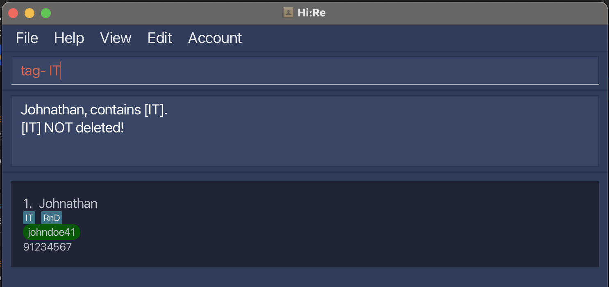

# **Hi:Re User Guide** :handshake:

---

## Table of Contents :book:
**Introduction**

- [Welcome Note](#welcome-note)
- [Product Information](#product-information)
- [Quick Start](#quick-start)
- [Commands](#commands)
---
**Account Management**

1) [Registering an account](#registering-an-account-register)
2) [Log in to account](#login-into-account-login)
3) [Logout from account](#logout-from-account-logout)
---
**Essential Features**

4) [Adding a contact](#adding-a-contact)
5) [Deleting a contact](#deleting-a-contact)
6) [Editing a contact](#editing-a-contact)
7) [Clearing all contacts](#clearing-all-contacts-clear)
---
**Basic Features**

8) [Toggling the display](#toggling-the-display)
9) [Finding contacts by name](#finding-contacts-by-name)
10) [Listing all matching information](#listing-all-matching-information-ls)
11) [Adding a tag](#adding-a-tag-tag)
12) [Deleting a tag](#deleting-a-tag-tag)
---
**Advanaced Features**

13) [Undoing a command](#undoing-a-command-undo)
14) [Redoing a command](#redoing-a-command-redo)
15) [Exporting as .csv file](#exporting-data)
16) [Link to user guide](#link-to-our-user-guide-help)
17) [Exiting Hi:Re](#exit-the-application-exit)
---
**Additional information**

- [Built-In Features](#built-in-features)
- [Design Methodology](#design-methodology)
- [FAQ](#faq)
- [Known Issues](#known-issues)
- [Command Summary](#command-summary)
- [Future Integrations](#future-integrations)
- [Support and Feedback](#support-and-feedback)

---

## Welcome Note
Greetings HR employees, managers and executives! 

- Tired from **scrolling** through endless rows in **spreadsheet** applications?
- Worried about **data leak** issues caused by the lack in security of such applications?
- Frustrated by the **slow, manual input** of cell by cell in such applications?
- Need an economically viable HR application?

*Hi:Re, our one-stop employee profiling application is for you!*

 \pagebreak 

#### User Guide Purpose:

This user guide serves to provide potential users like you with the information of Hi:Re, and 
to help new users onboard quickly and easily with Hi:Re. 

We recommend reading our **[product information](#product-information)** section first to understand what Hi:Re
can do for you and if it suits your companies' needs! After that,
dive into the **[quick start](#quick-start)** section, and we hope you
enjoy using Hi:Re as your company's HR employee profiling solution!

- Encounter any problems with commands? Our [Command](#commands) section provides step-by-step usage with examples, as well as error troubleshooting!
- Have any burning questions? Our [FAQ](#faq) and [Known Issues](#known-issues) sections outlines the most common scenarios faced by users like you!
- Curious about our future plans? Our [Future Integration](#future-integrations) section gives you a glimpse as to what is to come!

  <a href=#table-of-contents>
    back to top
    </a>
  

---

## Product Information

Hi:Re is a **desktop app for managing your employee details,
optimized for use via a Command Line Interface** (CLI)
while still having the benefits of a Graphical User Interface (GUI).

*Meaning:* Most work is done via *typing* :white_check_mark: commands on a command line instead of *clicking* :x: with your mouse :computer_mouse:!

- **Fast-typers**, Hi:Re will be your **best assistant** to get your contact management tasks done
  **faster** than traditional GUI apps.

- Regardless of your *technical skill* level, our User Guide will **bring you up to speed** and **quickly master** Hi:Re, that is already **streamlined for HR purposes**!

<box type="info" seamless> 

**<u>NOTE</u>:exclamation:**
**In Hi:Re, we adopt a system where contacts are identified by their email identity (ID for short) without the company email domain.**   
The ID is **case-insensitive** and **accepts special characters**, but **NOT whitespaces**.

Example: John is identified by his ID, `john123` without the domain, @123company.com

Hence, we <u>allow duplicate names and handphone numbers</u>.
Contacts are also required to be labelled with <u>minimally one</u> mandatory tag.
</box>

<u>Breakdown of commands</u>:
1) Account Management: Register, Login and Logout
2) Data Manipulation: Adding, Deleting, Editing a Contact and Clearing all Contacts
3) Data Observation: Toggling the Display, Finding Contacts by name, Listing all matching information 
4) Command Management: Undoing and Redoing a Command 
5) Data Portability: Exporting to .csv file
6) Link to our User Guide, Exit Hi:Re

  <a href=#table-of-contents>
    back to top
    </a>
  

---

 \pagebreak 

## Quick Start

1. Ensure you have `Java 11` or above installed in your Computer.

1. Download the latest `HiRe.jar` from [here](https://github.com/AY2324S2-CS2103T-T12-3/tp/releases).

1. Copy the file to the folder you want to use as the _home folder_.

1. Open a command terminal, change your directory, `cd`, to the folder you've placed the `HiRe.jar` file in

1. Run this command, `java -jar HiRe.jar`, to start the application. 
   A graphical user interface (GUI) similar to the below should appear in a few seconds. 

   <box type="info" seamless>Do note that the app contains sample data / contacts.</box>

    

1. Type commands in the `command box` and press the `[Enter]` _(Windows & Linux)_ / `[return]` _(macOS)_ key to execute it, **but first...**

1. [Register](#registering-an-account-register) an account before you are ready to use Hi:Re!

1. [Log-in to](#login-into-account-codelogincode) your newly registered account with the correct username and password!

1. Refer to the [Commands](#commands) below for the specific details of each command.

1. Refer to the [Built-In Features](#features) below for the details of each built-in feature.

  <a href=#table-of-contents>
    back to top
    </a>
  

---

 \pagebreak 

## Commands

<box type="info" seamless>

**Notes about the command format:** 

* Words in `()` are the parameters to be supplied by you, the user. 
  e.g. for `- /id (id)`, `(id)` is the parameter to be supplied by you. Input a similar command as follows into the command box: `- /id johndoe69`.

* Words in `{...}` are optional and may be repeated.
  e.g. in  `> /id (id) /tag (tag) {/tag (more tags)..}`, the second `/tag` parameter may be excluded, or repeated as many times as you want.

* When using a PDF version of this document, be careful when copying and pasting commands that span multiple lines as space characters surrounding line-breaks may be omitted when copied over to Hi:Re.
</box>

#### Disclaimer for Account Management Features (Register, Login & Logout)

While our Account Management Features may imply that our product is a multi-user product,
we would like to clarify and assure you that Hi:Re is a **single user product**.

Companies often form partnerships, collaborate and share resources.

Therefore, as an HR employee, you may be required to use **multiple address books** to effectively manage employees and partners from different companies.

To **safeguard the information of each company**, the use of multiple address books, locked behind different user accounts and passwords, is **essential**.

  <a href=#table-of-contents>
    back to top
    </a>
  

---

### Registering an account: `register`

Register an account to kickstart your own Hi:Re journey! When handling employees from more than one company, additional account(s) can be created to segregate their contact information.  
Format: `register /u (username) /p (password)`  
Example: `register /u johndoe /p 123456` 

<box type="important" seamless>

* A valid `password` should be between **6 - 20** characters long and does not contain spaces.   
* A valid `username` should be **alphanumeric** and between **4 - 10** characters long.   
* Usernames are **unique** and **cannot be duplicated**. 

</box>

* **Confirmation of successful registration** 

Upon successful registration, you will see a similar GUI as illustrated below. 

  <box type="success">
    Successful registration.   
      
  </box>

 \pagebreak 

* **How to handle error during registration?** 

    1. <u>Duplicate username eror</u>: If you enter a **non-unique** username, the error will be triggered. 
       <box type="wrong">
       Duplicate username error   
         
       </box>

    2. <u>Incomplete field error</u>: You are required to fill in all fields. Failure to complete all required fields will trigger the error. 
       <box type="wrong">
       Incomplete fields error   
         
       </box>

    3. <u>Invalid field error</u>: Any input field violating the requirements will trigger the error. You can follow the username and password requirements above.
       <box type="wrong">
       Invalid fields error   

        * Invalid username

         

        * Invalid password

         
       </box>

  <a href=#table-of-contents>
    back to top
    </a>
  

---

 \pagebreak 

### Log in to account: `login`

Log in to Hi:Re after creating your addressbook account.  
Format: `login /u (username) /p (password)`  
Example: `login /u johndoe /p 123456` 

<box type="important" seamless>

* A valid `password` should be between **6 - 20** characters long and does not contain spaces.   
* A valid `username` should be **alphanumeric** and between **4 - 10** characters long.  

</box>

* **Confirmation of successful login** 

Upon successfully login, you will see a similar GUI as illustrated below. 
You are also able to see the current addressbook file you are accessing in the status bar at the bottom of the application.  
Depending on your system, the file path may be different. 
Nonetheless, you should be able to see the correct username in the status.  
Before you log in, the status bar should display `"No user currently logged in"` or `"User .\data\addressbook.json has logged in"`, depending on your system. 

  <box type="success">
    GUI upon successful login command   
      
  </box> 

 \pagebreak 

* **How to handle error during login?** 

    1. <u>Incomplete field error</u>: You are required to fill in all fields. Failure to complete all required fields will trigger the error. 
       <box type="wrong">
       Incomplete fields error   
         
       </box>
    2. <u>Invalid field error</u>: Any input field violating the requirements will trigger the error. You can follow the username and password requirements above. 
       <box type="wrong">
       Invalid fields error   

        * Invalid username

         

        * Invalid password

         
       </box>
    3. <u>Incorrect username / password error</u>: If you have entered the username or password incorrectly, the error will be triggered. 
       <box type="wrong">
       Incorrect username or password error   
         
       </box>
    4. <u>Already logged-in error</u>: If you are already logged in, you cannot log in again. If you are switching to another account, do **logout first**, before you log in to another account that you have registered. 
       <box type="wrong">
       Already logged-in error:  
         
       </box>

  <a href=#table-of-contents>
    back to top
    </a>
  

---

 \pagebreak 

### Logout from Account: `logout`

After you have finished using Hi:Re, log out to protect your data.   
Format: `logout` 

**:bulb: Tip** 
You can also log out by clicking in the `Account` section of the menu bar.

* **Confirmation of successful logout** 

Upon successful log out, you will see a similar GUI as illustrated below. 

  <box type="success">
    GUI upon successful logout command   
     
  </box> 

* **How to handle errors during logout** 

    1. <u>Not logged-in error</u>: If you haven't logged in, you cannot log out. Attempting to do so will trigger the error. 
       <box type="wrong">
       Not logged-in error:  
         
       </box>

  <a href=#table-of-contents>
    back to top
    </a>
  

---

 \pagebreak 

### Adding a contact: `+`

  You can add a contact to the addressbook to save his / her contact details and information.   
  Format: <code>+ /name (name) /id (id) /hp (handphone) /tag (tag) {/tag (more tags)...} </code>  
  Example: 
  * With **one** tag:<code>+ /name John Doe /id johndoe41 /hp 98765432 /tag finance</code> 
  * With **more than one** tags:<code>+ /name John Doe /id johndoe41 /hp 98765432 /tag finance /tag sales</code> 

  <box type="important" seamless>

  * The order of each prefix and field set is **interchangeable**. You are abl to input each set of details in any sequence as long as **all required information is provided**.

  * The `name` should only contain **alphanumeric** characters and spaces, and should not be blank. 
  i.e. Names containing non-alphanumeric characters such as Rui-En or Ravi S/O Balakrishnan are not supported for the current version.

  * The `ID` must be **unique** for each contact. Attempting to use a duplicate ID will result in an error.

  * The `ID` can include alphabets, numbers, and special characters, but **cannot be blank** and **should not contain whitespaces**.

  * The `phone number` should **only contain numbers**, and it should be **at least 3 digits long**.

  * **Only one** `phone number` is allowed for the current version.

  * Excessively long fields will be text-wrapped appropriately.

  * All tags for a contact **MUST** be in the tag list. You can add tags to the tag list with the [add tag](#add-tag-tag) command.

  * A person **MUST** have at least one tag, and can have more than one tag (refer to example above)
  </box>

  (The Initial UI before addition)                       
     

 \pagebreak 

  * **Confirmation of successful contact addition** 

  Upon entering a valid set of inputs for the `+` command, you will see a similar GUI indicative of successful contact addition, as illustrated below.
  <box type="success">
    GUI upon successful `+` command   
      
  </box>

  * **How to handle contact when adding contacts?**  

    1. <u>Duplicate ID error</u>: You will trigger the error uppn the entry of a non-unique ID.  
       <box type="wrong">
       Duplicate ID error   
         
       </box>

 \pagebreak 

  2. <u>Incomplete field error</u>: You are required to fill in all fields. Failure to complete all required fields will trigger an error. 
      <box type="wrong">
      Incomplete field error   
        
      </box>
 
3. <u>Invalid field error</u>: Any input field violating the requirements will trigger the error. You can follow the requirements above. 
   <box type="wrong">
   Invalid field error   

   * Invalid name
   
     

   * Invalid phone number
   
     
   
   * Invalid ID
   
     

   * Invalid tag (tag not in tag list)
   
     
   </box>

   

  <a href=#table-of-contents>
    back to top
    </a>
  

---

 \pagebreak 

### Deleting a contact: `-`

  You can delete a contact from the addressbook when he/she leaves the company with his/her specified ID.  
  Format: <code>- /id (id)</code>  
  Example: <code>- /id johndoe46</code> 

  <box type="important" seamless>

  * The ID can include alphabets, numbers, and special characters, but cannot be blank and should not contain whitespaces.
  </box>
  (The Initial UI before deletion)
  
   

  * **Confirmation of contact deletion** 
  
  Upon deleting a contact successfully, you will see a similar GUI as illustrated below.

  <box type="success">

  * GUI upon successful `-` command   

      

  </box>

 \pagebreak 

  * **How to handle error when deleting?** 
  
    1. <u>ID not found error</u>: When you enter an ID that is not in the addressbook, the error will be triggered.
       <box type="wrong">
       ID not found error   
         
       </box>
    
    2. <u>Incomplete field error</u>: You are required to fill in the ID field. Failure to input the ID field with the correct prefix will trigger the error.
       <box type="wrong">
       Incomplete field error   
         
       </box>

    3. <u>Invalid field error</u>: If you input an ID that violates the requirements, you will trigger the error.
        <box type="wrong">
        Invalid field error   
          
        </box>

  <a href=#table-of-contents>
    back to top
    </a>
  

---

 \pagebreak 

### Editing a contact: `>`

When the employees updates their information, you can edit their details in the addressbook.  
Format: <code> > (id) /name (name) /hp (handphone) /tag (tag) {/tag (more tags)...}</code>  
Example: <code> > johndoe41 /name John Joe /hp 98765432</code> 

  <box type="important" seamless>

* The `ID` of the contact must be inputted first. The order of the other prefix and field sets are interchangeable, so you are able to input the details in any sequence. 
The `/id` prefix is **not used** in this command. 

* Fields to be edited are optional, but **at least 1 field** must be given, excluding `ID`. `ID` is used to identify the contact.

* If the all fields match the current contact's fields, the edit command will still go through and not give a duplicate person error message. This is due to our unique identifier ID.

* Should you wish to edit the `ID` of the person, please **delete** the contact and **add** the contact with the editted `ID`. 

* The `name` should only contain **alphanumeric** characters and spaces, and should not be blank. 
i.e. Names containing non-alphanumeric characters such as Rui-En or Ravi S/O Balakrishnan are not supported for the current version.

* The `phone number` should **only contain numbers**, and it should be **at least 3 digits long**.

* **Only one** `phone number` is allowed for the current version.

* Excessively long fields will be text-wrapped appropriately.

* When editing tags, the existing tags of the contact will be removed (i.e. adding of tags is not cumulative).

  </box>

(The Initial UI before editing)                       
 

 \pagebreak 

* **Confirmation of successful contact edit** 

Upon editing a contact successfully, you will see a similar GUI as illustrated below.
<box type="success">
GUI upon successful edit command   
  
</box>

* **Error Handling Protocols**

    1. <u>No ID Error</u>: If you did not provide any ID, the error will be triggered.
       <box type="wrong">
       No ID error   
         
       </box>
    2. <u>Incomplete field error</u>: You should provide at least one fail to be edited (excluding <code>ID</code>). Failure to provide at least 1 field will trigger the error.
       <box type="wrong">
       Incomplete field error   
         
       </box>

 \pagebreak 

 3. <u>Invalid field error</u>: Any input field violating the requirements will trigger the error. You can follow the requirements above.
    <box type="wrong">
    Invalid fields error   

     * Invalid name

      

     * Invalid phone number

      

     * ID not found

      
    </box>

  <a href=#table-of-contents>
    back to top
    </a>
  

---

### Clearing all contacts:  `clear`

When you want to reset your addressbook, you can clear all contacts from the current addressbook with this command.  
Format: `clear` 

  </box>

  

  <a href=#table-of-contents>
    back to top
    </a>
  

---

 \pagebreak 

### Toggling the display: `$`

You can toggle the display to view / hide the contacts panel of Hi:Re. 
This gives you a **cleaner and less-cluttered** application workspace and allows you to focus on entering the commands, especially if there are many contacts.  
Format: <code>$</code> 

**:bulb: Tip** 
You can also use this command by clicking in the `View` section of the menu bar.

  <box type="important" seamless>

* When your contacts panel is hidden, commands that show a list of contacts (like `ls` or `?`) will consequently **not appear to do anything**. 
Thus, if your result of one of these commands is unexpectedly empty, try toggling the panel and re-entering the command again.

  </box>
  
  <box type="definition">
    Viewing contacts.  
      
  </box>

  <box type="definition" theme="info">
    Hiding contacts.  
      
  </box>

  

  <a href=#table-of-contents>
    back to top
    </a>
  

---

### Finding contacts by name: `?`

Handling an addressbook with many contacts does not necessasrily mean an increase in difficulty in searching for a specific contact. Using the `?` command, you can find all contacts in the addressbook that has names containing the keyword(s) entered.  
Format: <code> ? (keyword) {(more keywords)...} </code> 

<box type="important" seamless>

* All names consist of **alphanumeric** characters, hence any <u>non-alphanumeric characters used will result in no contacts found</u>.

* All names containing the `(keyword)` entered will be matched. 
E.g `? jo` will give `John` if John exists in the address book.

* When more than one `(keyword)` is entered, all names that match with **any** of the keywords will be listed.  
E.g `? jo a` will give `John` and `Ali` if both of them exists in the address book.

* `(keyword)` used to match names are **CASE-INSENSITIVE**.
  </box>

Example:
  <box type="definition">
    Finding with one `(keyword)`: <code> ? al </code>  
      
  </box>

  <box type="definition" theme="info">
    Finding with more than one `(keyword)`: <code> ? al ch </code>  
      
  </box>

  <a href=#table-of-contents>
    back to top
    </a>
  

---

### Listing all matching information: `ls`

Similar to the find, `?`, function, you can add filter the contacts by tags! 

The `ls` function serves multiple purposes. You can list all matching information in the addressbook, list all tags or filter the contacts by tags.  
Format: <code>ls (args)</code>  
<code>(args)</code> = <code>-a</code>: List all contacts in the address book.  
<code>(args)</code> = <code>-t</code>: List all tags available.  
<code>(args)</code> = <code>(tag_name) {(more tag_name)...} </code>: List all contacts with any <code>(tag_name)</code> specified.  

<box type="important" seamless>

* All tags consist of **alphanumeric** characters, hence any non-alphanumeric characters used will result in no contacts found. 
* When more than one `(tag_name)` is entered, all tags that match **any** of the words will be listed. 
E.g `ls H fin` will list all contacts with tags containing `H` **OR** `fin`. 
* `(tag_name)` used to match tags are **CASE-SENSITIVE**.

  </box>
Example: 

  <box type="definition">
    <code>-a</code>: List all contacts in the address book. 
    Command: <code>ls -a</code>  
      
  </box>

  <box type="definition" theme="info">
    <code>(args)</code> = <code>-t</code>: List all tags available. 
    Command: <code>ls -t</code>  
      
  </box>

 \pagebreak 

  <box type="definition">
    <code>(tag_name)</code>: List all contacts with ONE <code>(tag_name)</code>. 
    Example: <code>ls H</code>  
      
  </box>

  <box type="definition" theme="info">
    <code>(tag_name)</code>: List all contacts with MORE THAN ONE <code>(tag_name)</code>. 
    Example: <code>ls H fin</code>  
      
  </box>

  <a href=#table-of-contents>
    back to top
    </a>
  

---

 \pagebreak 

### Adding a tag: `tag+`

You can add tags to categorise contacts to your liking! With the `tag+` function, you can customise the contacts of employees with their departments or other relevant information.  
Format: <code>tag+ (tag_name)</code>  

<box type="important" seamless>

* Default tags: `HR`, `operations`, `finance`, `marketing`, `IT`, `sales` & `RnD`

* Tags are **MUST** be **alphanumeric**.

* Tags are **CASE-SENSITIVE**.
  </box>

Example: 

 <box type="success">
    Adding the tag <code>CEO</code>: <code>tag+ CEO</code>  
      
  </box>

**How to handle error when adding tags?** 
<u>Duplicate tag error</u>: When you add a duplicate tag, the error will be triggered.

  <box type="wrong">
    Duplicate tag error.   
      
       </box>
  

  <a href=#table-of-contents>
    back to top
    </a>
  

---

 \pagebreak 

### Deleting a tag: `tag-`

You can delete an irrelevant tag from the tag list with `tag-` command. This prevents the cluttering of tag list with irrelevant / not-in-use tags.  
Format: <code>tag- (tag_name)</code>  

<box type="important" seamless>

* A tag cannot be removed if a contact is tagged with the tag-to-be-removed.
  </box>

Example: 

 <box type="success">
    Removing the tag <code>HR</code>: <code>tag- HR</code>  
      
  </box>

**How to handle error when deleting tags?** 
<u>Tag still in use error</u>: When you try to delete a tag that is still in use, the error will be triggered.

  <box type="wrong">
    Tag still in use error.   
      
       </box>

  <a href=#table-of-contents>
    back to top
    </a>
  

---

 \pagebreak 

### Undoing a command: `undo`

Did you make a mistake? Fret not, you can undo your previous action / command and restore the address book to the state before the previous **undoable** command was executed.  
Format: `undo` 
<box type="important" seamless>

* **Undoable commands**: those commands that modify the address book’s content ([add](#adding-a-contact), [delete](#deleting-a-contact), [edit](#editing-a-contact) and [clear](#clearing-all-contacts-clear)). 

* All other commands (including adding and deleting tags) **CANNOT** be undone _(as of the latest version)_.

* `undo` does not revert the [deletion of sample data](#deletion-of-sample-data-upon-first-addition).
  </box>

**:bulb: Tip** 
You can also use this command by clicking in the `Edit` section of the menu bar.

Example: 
1. Delete the person with the ID `johndoe41` using command: `- /id johndoe41`. 
2. `Undo` the deletion. The person will reappear.  

* **Confirmation of successful undo** 

  Upon undo-ing a command successfully, you will see a similar GUI as illustrated below. 

  <box type="success">
    GUI upon successful undo command   
     
  </box> 

* **How to handle error when undo-ing a command?** 

    1. No undoable command error: If there is no more executed command that can be undone, and you attempt to run the undo command, the error will be triggered. 
       <box type="wrong">
       No undoable command error   
         
       </box>

  <a href=#table-of-contents>
    back to top
    </a>
  

---

 \pagebreak 

### Redoing a command: `redo`

You can reverse the most recently undone command. This is helpful when you `undo` the command unintentionally.  
Format: `redo`  

**:bulb: Tip** 
You can also use this command by clicking in the `Edit` section of the menu bar.

Example: 
1. Delete the person with the ID `johndoe41` using command: `- /id johndoe41`. 
2. `Undo` the deletion. The person will reappear. 
3. `Redo` the undone deletion. The person will be deleted again.  

* **Confirmation of successful redo** 

  Upon undo-ing a command successfully, you will see a similar GUI as illustrated below. 

  <box type="success">
    GUI upon successful redo command   
     
  </box> 

* **How to handle an error when redo-ing a command?** 

    1. No redoable command error: If there is no more undone command that can be redone, and you attempt to run the redo command, the error will be triggered. 
       <box type="wrong">
       No redoable command error   
         
       </box>

  

  <a href=#table-of-contents>
    back to top
    </a>
  

---

 \pagebreak 

### Exporting data: `@`

You can export the data in the addressbook to a comma-separated values (`.csv`) file in the same directory Hi:Re is in. This is especially helpful when you require the data to be used on another platform that supports the widely accepted data file (`.csv` files).  
Format: `@ /filename (filename)`  
Example: `@ /file contacts` 

<box type="important" seamless>

* Note that you **need not** add the `.csv` file extension to the filename argument when executing this command. 
i.e. Hi:Re will do this for you! Hence, the command `@ /filename contacts` will export the data to `contacts.csv`.
  
* The filename should follow standard filename conventions on your system. (e.g. no special characters)

* If a `.csv` file already exists with the given filename, the command will **not** execute and an error will be thrown.
</box>

**Confirmation of Successful Export** 

   Upon a successful export, you will see a similar GUI as illustrated below.. 

  <box type="success">
    GUI upon successful export command   
      
  </box> 

 \pagebreak 

* **How to handle errors when exporting data?** 
  1. <u>Invalid filename error</u>: If you have provided an invalid filename for your current system, the error will be triggered. You can search up and follow the specific filename requirements for your system. 
      <box type="wrong">
      Invalid filename error   
        
      </box>

  1. <u>Filename already taken error</u>: If you have provided a name that is a duplicate of a `.csv` file exisitng in the same directory as the program, the error will be triggered. 
      <box type="wrong">
      Filename already taken error   
        
      </box>
  
  

  <a href=#table-of-contents>
    back to top
    </a>
  

---

 \pagebreak 

### Link to our User Guide: `help`

If you need to refer back to this guide, you can simply use the `help` command. It will lead you to our user guide (i.e. this page) when using Hi:Re!  
Format: `help` 

 <box type="success">
    Pop-up box upon running the command.  
      
  </box>

  <a href=#table-of-contents>
    back to top
    </a>
  

---

### Exit the application: `exit`

After using Hi:Re, you can close the application by using the `exit` command. It will log the user out of their account, and close the Hi:Re application window.

Format: `exit`

  <a href=#table-of-contents>
    back to top
    </a>
  

---

 \pagebreak 

## Built-In Features

These are features built-in for your ease of use! No commands are required for it to work.

* Sort
* Deletion of sample data upon first addition

  <a href=#table-of-contents>
    back to top
    </a>
  

---

### Sort
  The addressbook is sorted in alphabetical order by name every time you add / edit / delete a new contact. 

  <a href=#table-of-contents>
    back to top
    </a>
  

---

### Deletion of sample data upon first addition

By adding your first contact into Hi:Re, the sample data will be deleted! This function will be in place for every new account.  
  
<box type="important" seamless>

  It is important that you do **NOT** perform any operations other than adding contacts upon your first log in, as there is no guarantee that this feature will work properly afterwards.

  **Note**: `undo` does not revert this action.
  </box>

  <box type="definition">
    Before:  
      
  </box>

  <box type="definition" theme="info">
    After:  
      
  </box>

  <a href=#table-of-contents>
    back to top
    </a>
  

---

### Information security

  Hi:Re seeks to protect the private and personal information in your addressbook.  

  1. **Password Hashing** 
     We use the SHA-256 hashing algorithm to hash the passwords. 
     Passwords are hashed before being stored. Hence, even if your data file is compromised, your passwords are not easily retrievable. 

  <a href=#table-of-contents>
    back to top
    </a>
  

---

 \pagebreak 

## Design Philosophy

Our software development team has meticulously crafted this application to provide
you with a seamless and intuitive user experience.
At the heart of our design methodology lies a commitment to simplicity, efficiency, and user-centricity.

**Dark Blue UI for Enhanced Comfort**

Our application features a sophisticated dark blue user interface, carefully chosen to promote relaxation and reduce eye
strain during extended usage sessions. We understand the importance of creating an environment that is both visually
appealing and gentle on the eyes. By embracing dark blue as our primary color scheme, we aim to enhance your overall
experience and encourage prolonged engagement with the application.

**Toggle Display Option for Streamlined Navigation**

Navigating through large amounts of contact data can be overwhelming. That's why we've implemented a convenient toggle display
option, allowing you to effortlessly hide or reveal extensive contact data sets with a simple click. This feature empowers you
to customize your viewing experience, providing flexibility and control over the information displayed on your screen.
Whether you're focusing on specific details or seeking a clutter-free interface, our toggle display option ensures seamless
navigation and enhanced productivity.

**Command-based Data Entry System**

We believe in minimizing unnecessary mouse usage and maximizing efficiency in data entry tasks. Our application boasts
a streamlined command-based data entry system, designed to simplify the input process and minimize user effort.
By leveraging intuitive keyboard commands, you can swiftly navigate through fields, input data, and execute commands
with precision and speed. This approach not only accelerates contact manipulation tasks but also reduces cognitive load, allowing
you to focus on your workflow without distractions.

**In summary**, our application's design methodology is guided by a dedication to user comfort, efficiency, and accessibility.
From the calming dark blue UI to the streamlined command-based data entry system, every aspect of our design reflects our
unwavering commitment to enhancing your productivity and satisfaction.

  <a href=#table-of-contents>
    back to top
    </a>
  

---

 \pagebreak 

## FAQ

**Q**: How do I transfer my data to another Computer?" 

**A**: You can install Hi:Re in the other computer and overwrite the empty data file it creates with the file that contains the data of your previous Hi:Re home folder.  

**Q**: What is Java 11 and where can I download it?" 

**A**: Java 11 is the version of the Java Programming Language that our application uses to function. Any version of Java, 11 and above will work. You can download it from the [official Java website](https://www.oracle.com/sg/java/).  

  <a href=#table-of-contents>
    back to top
    </a>
  

---

## Known issues

1. **When using multiple screens**, if you move the application to a secondary screen, and later switch to using only the primary screen, the GUI will open off-screen. The remedy is to delete the `preferences.json` file created by the application before running the application again.

2. Sample data sometimes does not clear if it is edited **before** a new contact is added. As such, we recommend that you add a new contact immediately upon first logging into Hi:Re **before** executing any other commands.

3. **When your contacts panel is hidden**, commands that show a list of contacts (like `ls` or `?`) will consequently not appear to do anything Thus, if your result of one of these commands is unexpectedly empty, try toggling the panel and re-entering the command again.

4. Currently you cannot directly recover passwords of your accounts. If you forget the account password for a certain addressbook, please open `accounts.txt` and delete the whole line with the username of that addressbook. Then, you can launch the application and `register` an account with the **same username** to access the original addressbook. Apart from this, please do not arbitrarily edit the .txt file, as this may cause account information to be read incorrectly or even cause the application to fail to start.

  <a href=#table-of-contents>
    back to top
    </a>
  

  
 ---

 \pagebreak 

## Command summary

Action | Command Format
---|---
**Register** an account | `register /u (username) /p (password)`
**Login** into an account | `login /u (username) /p (password)`
**Logout** from an account | `logout`
**Add** a contact | `+ /name (name) /id (id) /hp (handphone) /tag (tag) {/tag (more tags)...}`
**Delete** a contact | `- /id (id)`
**Edit** a contact | `> (id) /name (name) /hp (handphone) /tag (tag) {/tag (more tags)...}`
**Clear** all contacts | `clear`
**Toggle** display | `$`
**Find** contacts by name | `? (keyword) {(more keywords)...}`
**List** all matching information | `ls (args)`
**Add** a **tag** | `tag+ (tag_name)`
**Delete** a **tag** | `tag- (tag_name)`
**Undo** previous command | `undo`
**Redo** a command | `redo`
**Export** data | `@`
Link to user guide | `help`
**Exit** the application | `exit`

  <a href=#table-of-contents>
    back to top
    </a>
  

---

 \pagebreak 

## Future Integrations

**In the future, we plan to integrate some of the following features:**

1. **A more rigorous account management system**, which will allow you to manage users as an administrator, and assign different levels of authentication or security to the different personal data collected.

2. **A remote database management system**, which links all Hi:Re instances on different machines to the same Hi:Re database. This will allow you to collaborate with other Hi:Re users! There are more benefits to having a database system in place.

3. **More open-ended tagging and field options**, allowing for Hi:Re to be fully customisable by you as per your organisation's requirements.

4. **Multiple phone numbers**, you to add in both the employees' office and personal phone numbers to the same contact.

5. **Improving input acceptance**, will allow you to be more flexible with the case-sensitivity and characters when it comes to `name`s and `tag`s.

  <a href=#table-of-contents>
    back to top
    </a>
  

---

## Support and Feedback

We are a dedicated team of developers committed to evolving Hi:Re to always be better, and to serve you better!

If you have any enquiries or feedback, do reach out to us at our [website!](https://github.com/AY2324S2-CS2103T-T12-3)

  <a href=#table-of-contents>
    back to top
    </a>
  

