# Hi:Re User Guide

---

## Table of Contents

- [Welcome Note](#welcome-note)
- [Product Information](#product-information)
- [Quick Start](#quick-start)
- [Commands](#commands)
---
1) [Registering an Account](#registering-an-account-register)
2) [Login into Account](#login-into-account-login)
3) [Logout from Account](#logout-from-account-logout)
---
4) [Adding a Contact](#adding-a-contact)
5) [Deleting a Contact](#deleting-a-contact)
6) [Editing a Contact](#editing-a-contact)
7) [Clearing all Contacts](#clearing-all-contacts-clear)
---
8) [Toggling the display](#toggling-the-display)
9) [Finding Contacts by Name](#finding-contacts-by-name)
10) [Listing all matching information](#listing-all-matching-information-ls)
---
11) [Undoing a Command](#undoing-a-command-undo)
12) [Redoing a Command](#redoing-a-command-redo)
13) [Exporting to CSV](#exporting-data)
14) [Link to User Guide](#link-to-our-user-guide-help)
15) [Exit the Hi:Re application](#exit-the-application-exit)
---
- [Built-In Features](#built-in-features)
- [Design Methodology](#design-methodology)
- [FAQ](#faq)
- [Known Issues](#known-issues)
- [Command Summary](#command-summary)
- [Future Integrations](#future-integrations)
- [Support and Feedback](#support-and-feedback)

---

## Welcome Note
Greetings HR employees, managers and executives! 

- Tired from **scrolling** through endless rows in **spreadsheet** applications?
- Worried about **data leak** issues caused by the lack in security of such applications?
- Frustrated by the **slow input** of cell by cell in such applications?
- Need an economically viable HR application?

*Hi:Re, our one-stop employee profiling application is for you!*

 \pagebreak 

#### **User Guide Purpose:** 

This user guide serves to provide potential users like you with the information of Hi:Re, and 
to help new users onboard quickly and easily with Hi:Re. 

We recommend reading our **[product information](#product-information)** section first to understand what Hi:Re
can do for you and if it suits your companies' needs! After that,
dive into the **[quick start](#quick-start)** section, and we hope you
enjoy using Hi:Re as your company's HR employee profiling solution!

- Encounter any problems with commands? Our [Command](#commands) section provides step-by-step usage with examples, as well as error troubleshooting!
- Have any burning questions? Our [FAQ](#faq) and [Known Issues](#known-issues) sections outlines the most common scenarios faced by users like you!
- Curious about our future plans? Our [Future Integration](#future-integrations) section gives you a glimpse as to what is to come!

  <a href=#table-of-contents>
    back to top
    </a>
  

---

## Product Information

Hi:Re is a **desktop app for managing your employee details,
optimized for use via a Command Line Interface** (CLI)
while still having the benefits of a Graphical User Interface (GUI).

*Meaning:* Most work is done via *typing* commands on a command line instead of *clicking* with your mouse!

- **Fast types**, Hi:Re will be your **best assistant** to get your contact management tasks done
  **faster** than traditional GUI apps.
- Regardless of your *technical skill* level, our User Guide will **bring you up to speed** and **quickly master**
  Hi:Re, that is already **streamlined for HR purposes**!

<box type="info" seamless> 

**IMPORTANT: In Hi:Re, we adopt a system where contacts are identified by their email id(ID for short) without the
company email domain.**   

*John is identified by his ID, john123 without the domain, @123company.com*

Hence, we allow duplicate names and handphone numbers.
Contacts are also labelled with one mandatory tag and optional additional tags.
</box>

<u>Breakdown of commands</u>:
1) Account Management: Register, Login and Logout
2) Data Manipulation: Adding, Deleting, Editing a Contact and Clearing all Contacts
3) Data Observation: Toggling the Display, Finding Contacts by name, Listing all matching information 
4) Command Management: Undoing and Redoing a Command 
5) Data Portability: Exporting to .csv file
6) Link to our User Guide, Exit Hi:Re

  <a href=#table-of-contents>
    back to top
    </a>
  

---

 \pagebreak 

## Quick Start

1. Ensure you have `Java 11` or above installed in your Computer.

1. Download the latest `HiRe.jar` from [here](https://github.com/AY2324S2-CS2103T-T12-3/tp/releases).

1. Copy the file to the folder you want to use as the _home folder_.

1. Open a command terminal, `cd` into the folder you put the `HiRe.jar` file in, and use the `java -jar HiRe.jar` command to run the application. 

   A GUI similar to the below should appear in a few seconds. 
   
   <box type="info" seamless>Note how the app contains some sample data.</box>

    

1. Type commands in the `command box` and press the `[Enter]` key to execute it, but first...

1. [Register](#registering-an-account-register) an account before you are ready to use Hi:Re!

1. [Log into](#login-into-account-login) your newly registered account with the correct username and password!

1. Refer to the [Commands](#commands) below for details of each command.

1. Refer to the [Built-In Features](#built-in-features) below for details of built-in features.

  <a href=#table-of-contents>
    back to top
    </a>
  

---

 \pagebreak 

## Commands

<box type="info" seamless>

**Notes about the command format:** 

* Words in `()` are the parameters to be supplied by you, the user. 
  e.g. for `- /id (id)`, `(id)` is the parameter to be supplied by you. Input a similar command as follows into the command box: `- /id johndoe69`.

* Words in `{...}` are optional and may be repeated.
  e.g. in  `> /id (id) /tag (tag) {/tag (more tags)..}`, the second `/tag` parameter may be excluded, or repeated as many times as you want.

* When using a PDF version of this document, be careful when copying and pasting commands that span multiple lines as space characters surrounding line-breaks may be omitted when copied over to Hi:Re.
</box>

#### Disclaimer for Account Features (Register, Login, Logout)

While our Account Features seem to say that our product is a multi-user product,
we would like to clarify that our intended purpose is a **single user product**.

Companies often form partnerships and share resources.

Therefore, HR employees like you may be **required to use multiple address books** to effectively manage employees from different companies.

To **safeguard the information of each company**, the use of multiple address books locked behind different user accounts and passwords **is essential**.

  <a href=#table-of-contents>
    back to top
    </a>
  

---

### Registering an Account: `register`

Register an account first to have your own addressbook!  
Format: `register /u (username) /p (password)`  
Example: `register /u johndoe /p 123456` 

  <box type="important" seamless>

* A valid password is between 6 and 20 characters long and does not contain spaces.   
* A valid username should be alphanumeric and between 4 and 10 characters long.   
* Usernames are unique and cannot be duplicated.  
  </box>
* **Confirmation of Successful Registration** 

If you register successfully, a GUI indicative of a successful registration will be displayed, as illustrated below. 

  <box type="success">
    GUI upon successful register command   
     
  </box>

 \pagebreak 

* **Error Handling Protocols** 

    1. Duplicate username Error: Entry of a non-unique username will trigger an error. 
       <box type="wrong">
       Duplicate username error   
         
       </box>
    2. Incomplete Fields Error: Failure to complete all required fields will trigger an error. 
       <box type="wrong">
       Incomplete fields error   
         
       </box>

    3. Invalid Fields Error: Any input field violating the requirements mentioned above will trigger an error.
       <box type="wrong">
       Invalid fields error   

        * Invalid username

         

        * Invalid password

         
       </box>

  <a href=#table-of-contents>
    back to top
    </a>
  

---

 \pagebreak 

### Login into Account: `login`

Log in to access your addressbook.   
Format: `login /u (username) /p (password)`  
Example: `login /u johndoe /p 123456` 

  <box type="important" seamless>

* A valid password is between 6 and 20 characters long and does not contain spaces.   
* A valid username should be alphanumeric and between 4 and 10 characters long.   
  </box>
* **Confirmation of Successful Login** 

If you login successfully, a graphical user interface (GUI) indicative of a successful login will be displayed, as illustrated below. 
After you log in successfully, you can see the current addressbook file you are accessing in the status bar at the bottom of the application. 
Depending on your system, the file path may be displayed differently. But you should at least see the correct username appearing in the status. 
(Before you log in, the status bar should display "No user currently logged in" or "User .\data\addressbook.json has logged in", depending on your system.) 

  <box type="success">
    GUI upon successful login command   
     
  </box> 

 \pagebreak 

* **Error Handling Protocols** 

    1. Incomplete Fields Error: Failure to complete all required fields will trigger an error. 
       <box type="wrong">
       Incomplete fields error   
         
       </box>
    2. Invalid Fields Error: Any input field violating the requirements mentioned above will trigger an error. 
       <box type="wrong">
       Invalid fields error   

        * Invalid username

         

        * Invalid password

         
       </box>
    3. Incorrect Username or Password Error: If the username or password is incorrect, an error will be triggered. 
       <box type="wrong">
       Incorrect username or password error   
         
       </box>
    4. Already Logged In Error: If the user is already logged in, he cannot log in again. 
       <box type="wrong">
       Already logged in error:  
         
       </box>

  <a href=#table-of-contents>
    back to top
    </a>
  

---

 \pagebreak 

### Logout from Account: `logout`

Once done accessing your addressbook, log out to protect your data.   
Format: `logout` 

**:bulb: Tip** 
You can also log out by clicking in the `Account` section of the menu bar.

* **Confirmation of Successful Logout** 

If you log out successfully, a GUI indicative of a successful logout will be displayed, as illustrated below. 

  <box type="success">
    GUI upon successful logout command   
     
  </box> 

* **Error Handling Protocols** 

    1. Not Logged Error: If the user hasn't logged in, he cannot log out. 
       <box type="wrong">
       Not Logged Error:  
         
       </box>

  <a href=#table-of-contents>
    back to top
    </a>
  

---

 \pagebreak 

### Adding a contact: `+`

  You can add a contact to the addressbook.  

  Format: <code>+ /name (name) /id (id) /hp (handphone) /tag (tag) {/tag (more tags)...} </code> 

  Example: <code>+ /name John Doe /id johndoe41 /hp 98765432 /tag finance</code> 
        <code>+ /name John Doe /id johndoe41 /hp 98765432 /tag finance /tag sales</code> 

  <box type="important" seamless>

  * The order of each prefix and field set is interchangeable. Feel free to input each set of details in any sequence as long as all required information is provided.

  * The name should only contain alphanumeric characters and spaces, and should not be blank. S/O and hyphened names(E.g Rui-En) are not supported in our current product.

  * The ID must be unique for each contact. Attempting to use a duplicate ID will result in an error.

  * The ID can include alphabets, numbers, and special characters, but cannot be blank and should not contain whitespaces.

  * The phone number should only contain numbers, and it should be at least 3 digits long.

  * Only one phone number is allowed. Refer to future integrations for more info. 

  * Excessively long fields will have the text wrapped appropriately.

  * All tags for a contact **MUST** already exist in the tag list. You can add tags to a tag list with the [add tag](#add-tag-tag) command.

  * A person **MUST** have at least one tag, but can have more than one tag (refer to example above)
  </box>

  (The Initial UI before addition)                       
     

 \pagebreak 

  * **Confirmation of Successful Contact Addition** 

  Following a valid set of inputs for the command, a GUI indicative of a successful contact addition will be displayed, as illustrated below.
  <box type="success">
    GUI upon successful addition command   
      
  </box>

  * **Error Handling Protocols**  

    1. Duplicate ID Error: Entry of a non-unique ID will trigger an error. 
       <box type="wrong">
       Duplicate ID error   
         
       </box>

 \pagebreak 

2. Incomplete Fields Error: Failure to complete all required fields will trigger an error. 
   <box type="wrong">
   Incomplete fields error   
     
   </box>
 
3. Invalid Fields Error: Any input field violating the requirements mentioned above will trigger an error.
   <box type="wrong">
   Invalid fields error   

   * Invalid name
   
     
   </box>

 \pagebreak 

   <box type="wrong"> 

   * Invalid phone number
   
     
   
   * Invalid id
   
     
   </box>

  <a href=#table-of-contents>
    back to top
    </a>
  

---

 \pagebreak 

### Deleting a contact: `-`

  You can delete a contact with his/her specified ID.  

  Format: <code>- /id (id)</code> 

  Example: <code>- /id johndoe46</code> 

  <box type="important" seamless>

* The ID can include alphabets, numbers, and special characters, but cannot be blank and should not contain whitespaces.

  </box>
  (The Initial UI before deletion)
  
   

  * **Confirmation of Contact Deletion** 
  
  When the deletion is successful, a graphical user interface (GUI) indicative of a successful contact deletion will be displayed, as illustrated below.

  <box type="success">

  * GUI upon successful addition command   

      

  </box>

 \pagebreak 

  * **Error Handling Protocols** 
  
    1. ID Not Found Error: If there is no such contact with the input ID in the list, an error will be triggered.
       <box type="wrong">
       ID not found error   
         
       </box>
    
    2. Incomplete Field Error: Failure to input the required id with the correct prefix will trigger an error.
       <box type="wrong">
       Incomplete field error   
         
       </box>

    3. Invalid Field Error: If the input ID violates the requirements, it is invalid and should trigger an error.
        <box type="wrong">
        Invalid field error   
          
        </box>

  <a href=#table-of-contents>
    back to top
    </a>
  

---

 \pagebreak 

### Editing a contact: `>`

You can edit a contact's details in the addressbook.  

Format: <code> > (id) /name (name) /hp (handphone) /tag (tag) {/tag (more tags)...}</code> 

Example: <code> > johndoe41 /name John Joe /hp 98765432</code> 

  <box type="important" seamless>

* The ID of the contact without the `/id` prefix must be inputted first. The order of the other prefix and field sets are interchangeable and doesn't matter. 
Feel free to input the details in any sequence. 

* Fields to be edited are optional, but at least 1 field must be given, excluding ID. ID is used to identify the contact.

* The phone number should only contain numbers, and it should be at least 3 digits long.

* The name should only contain alphanumeric characters and spaces, and should not be blank.

* If the fields match the current contact's fields exactly, the edit will still go through and not give a duplicate person error message. This is due to our unique identifier ID.

* Should you wish to edit the ID of the person, please delete the contact and re-add the contact with the correct ID. 

* When editing tags, the existing tags of the contact will be removed (i.e adding of tags is not cumulative.)

  </box>

(The Initial UI before editing)                       
 

 \pagebreak 

* **Confirmation of Successful Contact Editing** 

Following a valid set of inputs for the command, a GUI indicative of a successful contact addition will be displayed, as illustrated below.
<box type="success">
GUI upon successful addition command   
  
</box>

* **Error Handling Protocols** 
    1. No ID Error: No ID given will trigger an error.
       <box type="wrong">
       No ID error   
         
       </box>
    2. Incomplete Fields Error: Failure to complete at least 1 field will trigger an error.
       <box type="wrong">
       Incomplete fields error   
         
       </box>

 \pagebreak 

 3. Invalid Fields Error: Any input field violating the requirements mentioned above will trigger an error.
    <box type="wrong">
    Invalid fields error   

     * Invalid name

      

     * Invalid phone number

      

     * Id not found

      
    </box>

  <a href=#table-of-contents>
    back to top
    </a>
  

---

### Clearing all contacts:  `clear`

You can clear all contacts from the current addressbook.  

Format: `clear` 

  </box>

  

  <a href=#table-of-contents>
    back to top
    </a>
  

---

 \pagebreak 

### Toggling the display: `$`

You can toggle the display to view / hide the contacts panel of Hi:Re. 
This gives you a cleaner and less-cluttered application workspace, especially if there are many contacts. 

  Format: <code>$</code> 

**:bulb: Tip** 
You can also use this command by clicking in the `View` section of the menu bar.

  <box type="important" seamless>

* When your contacts panel is hidden, commands that show a list of contacts (like `ls` or `?`) will consequently not appear to do anything. 
Thus, if your result of one of these commands is unexpectedly empty, try toggling the panel and re-entering the command again.

  </box>
  
  <box type="definition">
    Viewing contacts.  
      
  </box>

  <box type="definition" theme="info">
    Hiding contacts.  
      
  </box>

  

  <a href=#table-of-contents>
    back to top
    </a>
  

---

### Finding Contacts by Name: `?`

You can find all contacts in the addressbook that has names containing the keyword(s) entered.

Format: <code> ? (keyword) {(more keywords)...} </code> 

<box type="important" seamless>

* All names consist of alphanumeric characters, hence any non-alphanumeric characters used will result in no contacts found.
* All names that contain the `(keyword)` entered will be matched. E.g `? jo` will give John if John exists in the address book.
* When more than one `(keyword)` is entered, all names that match **any** of the keywords will be listed. E.g `? jo a` will give John and Ali if both of them exists in the address book.
* `(keyword)` used to match names are **CASE-INSENSITIVE**.
  </box>

Example:
  <box type="definition">
    Finding with one `(keyword)`: <code> ? al </code>  
    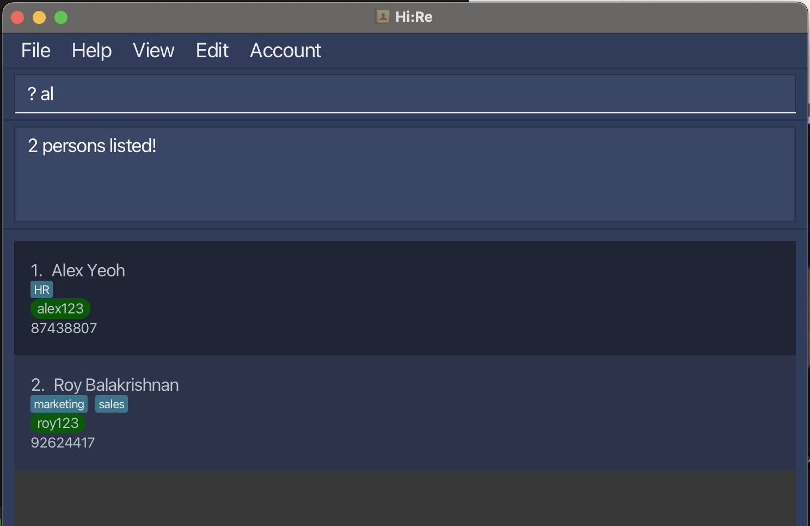  
  </box>

  <box type="definition" theme="info">
    Finding with more than one `(keyword)`: <code> ? al ch </code>  
    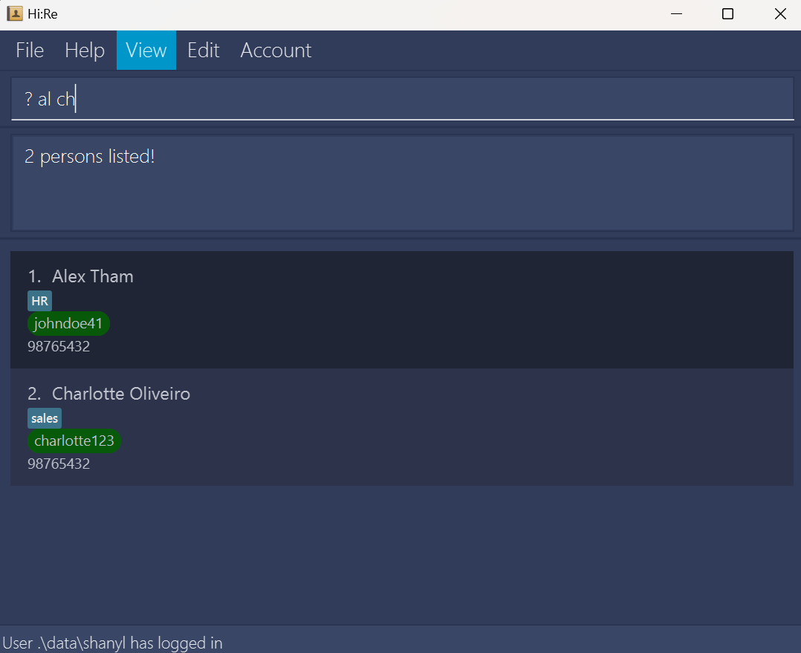  
  </box>

  <a href=#table-of-contents>
    back to top
    </a>
  

---

### Listing all matching information: `ls`

You can list all matching information in the addressbook for different purposes.  

Format: <code>ls (args)</code> 

<code>(args)</code> = <code>-a</code>: List all contacts in the address book.  
<code>(args)</code> = <code>-t</code>: List all tags available.  
<code>(args)</code> = <code>(tag_name) {(more tag_name)...} </code>: List all contacts with any <code>(tag_name)</code> specified.  

<box type="important" seamless>

* All tags consist of alphanumeric characters, hence any non-alphanumeric characters used will result in no contacts found. 
* When more than one `(tag_name)` is entered, all tags that match **any** of the words will be listed. 
E.g `ls H fin` will list all contacts with tags containing `H` **OR** `fin`. 
* `(tag_name)` used to match tags are **CASE-SENSITIVE**.

  </box>
Example: 

  <box type="definition">
    <code>-a</code>: List all contacts in the address book. 
    Command: <code>ls -a</code>  
    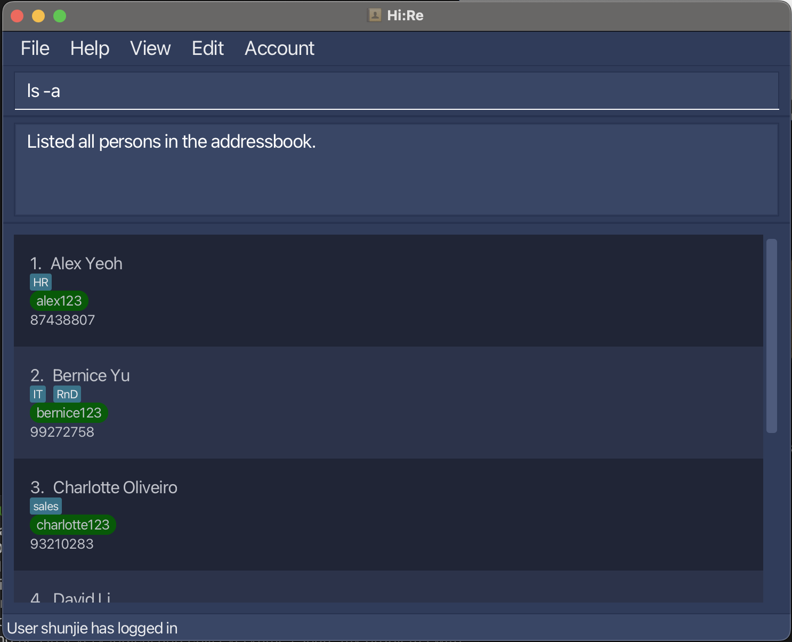  
  </box>

  <box type="definition" theme="info">
    <code>(args)</code> = <code>-t</code>: List all tags available. 
    Command: <code>ls -t</code>  
    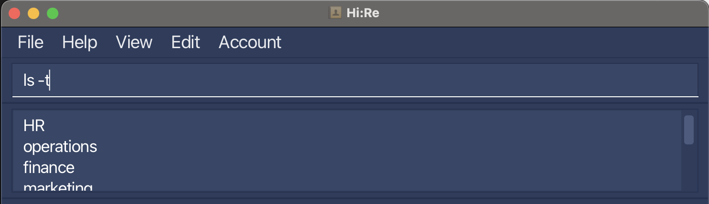  
  </box>

 \pagebreak 

  <box type="definition">
    <code>(tag_name)</code>: List all contacts with ONE <code>(tag_name)</code>. 
    Example: <code>ls H</code>  
    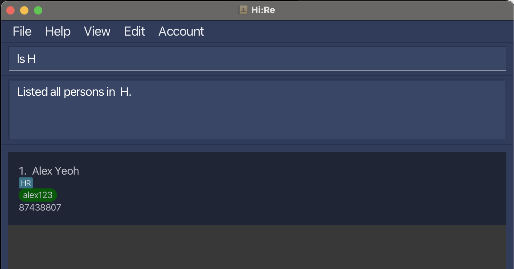  
  </box>

  <box type="definition" theme="info">
    <code>(tag_name)</code>: List all contacts with MORE THAN ONE <code>(tag_name)</code>. 
    Example: <code>ls H fin</code>  
    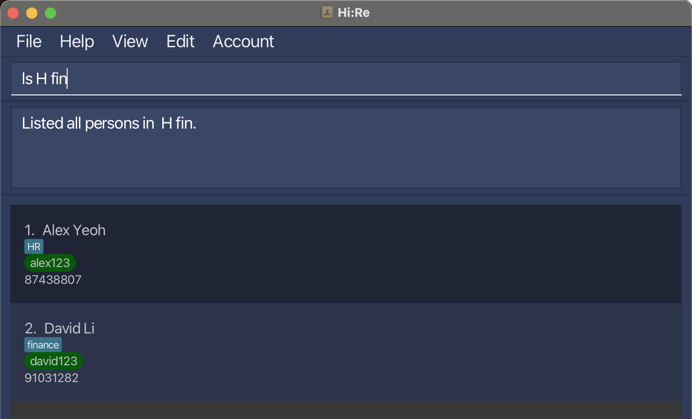  
  </box>

  <a href=#table-of-contents>
    back to top
    </a>
  

---

 \pagebreak 

### Add Tag: `tag+`

You can add a tag into the tag list.  

Format: <code>tag+ (tag_name)</code> 

<box type="important" seamless>

* Default tags: `HR`, `operations`, `finance`, `marketing`, `IT`, `sales` & `RnD`
* Tags are **CASE-SENSITIVE**.
  
  </box>

Example: 

 <box type="success">
    Adding the tag <code>CEO</code>: <code>tag+ CEO</code>  
    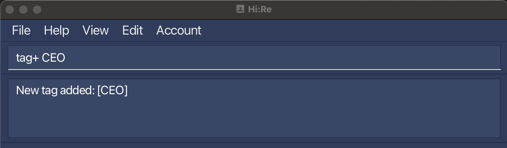  
  </box>

**Error Handling Protocols** 

  <box type="wrong">
    Duplicate tags.   
    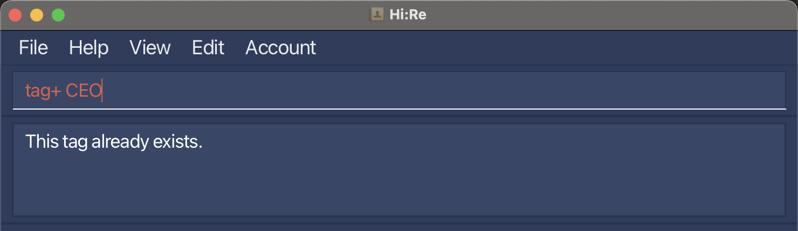  
       </box>
  

  <a href=#table-of-contents>
    back to top
    </a>
  

---

 \pagebreak 

### Delete Tag: `tag-`

You can delete a tag from the tag list.  

  Format: <code>tag- (tag_name)</code> 

<box type="important" seamless>

* Tag cannot be removed if a contact is tagged with the tag-to-be-removed.
  </box>

Example: 

 <box type="success">
    Removing the tag <code>HR</code>: <code>tag- HR</code>  
    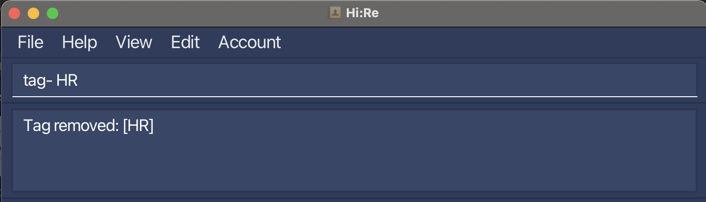  
  </box>

  <a href=#table-of-contents>
    back to top
    </a>
  

---

 \pagebreak 

### Undoing a Command: `undo`

You can restore the address book to the state before the previous **undoable** command was executed.  

Format: `undo` 
<box type="important" seamless>

* Undoable commands: those commands that modify the address book’s content (add, delete, edit and clear). 
* All other commands (including adding and deleting tags) **CANNOT** be undone.
  </box>

**:bulb: Tip** 
You can also use this command by clicking in the `Edit` section of the menu bar.

Example: 
1. Delete the person with the id `johndoe41` using command: - /id johndoe41.  
2. Undo the deletion. The person will reappear.  

* **Confirmation of Successful Undo** 

  If there is still any executed command that can be undone, a GUI indicative of a successful undo will be displayed, as illustrated below. 

  <box type="success">
    GUI upon successful undo command   
     
  </box> 

* **Error Handling Protocols** 

    1. No Undoable Command Error: If there is no more executed command that can be undone, an error will be triggered. 
       <box type="wrong">
       No undoable command error   
         
       </box>

  <a href=#table-of-contents>
    back to top
    </a>
  

---

 \pagebreak 

### Redoing a Command: `redo`

You can reverse the most recently undone command.  

Format: `redo` 

**:bulb: Tip** 
You can also use this command by clicking in the `Edit` section of the menu bar.

Example: 
1. Delete the person with the id `johndoe41` using command: - /id johndoe41.  
2. Undo the deletion. The person will reappear.  
3. Redo the undone deletion. The person will be deleted again.  

* **Confirmation of Successful Redo** 

  If there is still any undone command that can be redone, a GUI indicative of a successful redo will be displayed, as illustrated below. 

  <box type="success">
    GUI upon successful redo command   
     
  </box> 

* **Error Handling Protocols** 

    1. No Redoable Command Error: If there is no more undone command that can be redone, an error will be triggered. 
       <box type="wrong">
       No redoable command error   
         
       </box>

  

  <a href=#table-of-contents>
    back to top
    </a>
  

---

 \pagebreak 

### Exporting data: `@`
[back to top](#table-of-contents)

You can export the data in the addressbook to a comma delimited file in the same directory Hi:Re is in. 

Format: `@ /filename (filename)` 

Example: <code> export /file contacts </code> 

  <box type="important" seamless>

* Note that you need not add the `.csv` file extension to the filename argument when executing this command - Hi:Re will do this for you. Hence, typing `@ /filename contacts` will export the data to `contacts.csv`.
  
* The filename should follow standard filename conventions on your system. (e.g. no special characters)

* If a CSV file already exists with the given filename, the command will **not** execute and an error will be thrown.

  </box>

* **Confirmation of Successful Export** 

   Following a valid set of inputs for the command, a GUI indicative of a successful export will be displayed, as illustrated below. 

  <box type="success">
    GUI upon successful export command   
    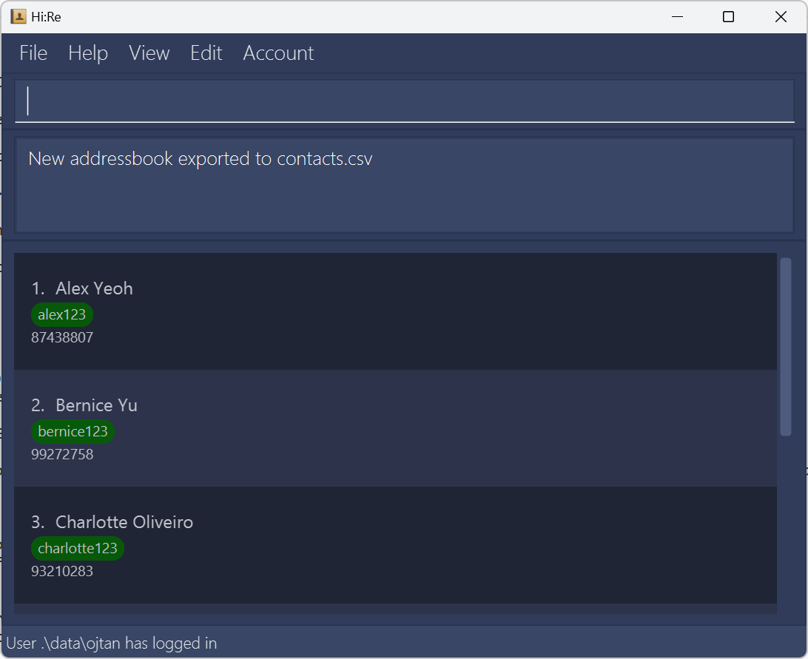  
  </box> 

 \pagebreak 

* **Error Handling Protocols** 
  1. Invalid Filename Error: If the given filename is invalid given for the current system, an error will be triggered. 
      <box type="wrong">
      Invalid filename error   
      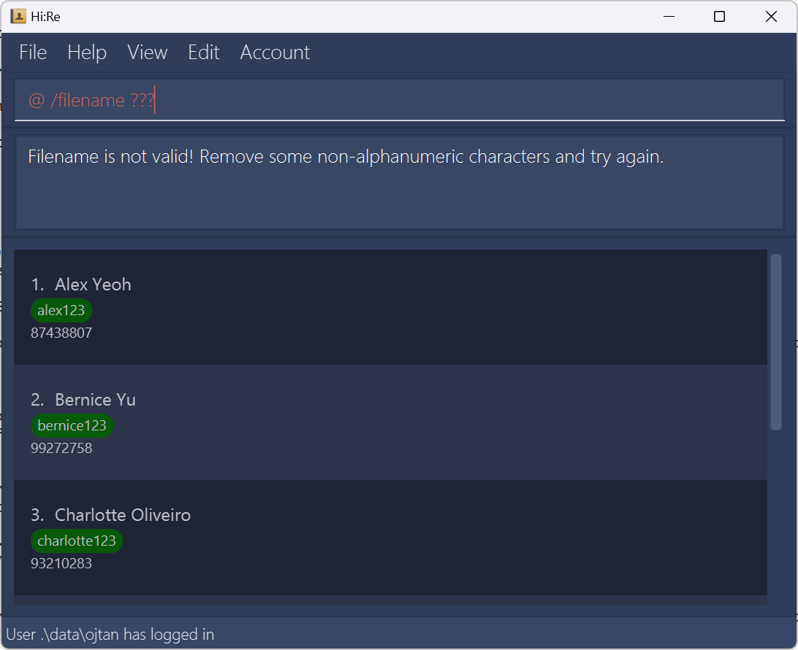  
      </box>

  1. Filename Already Taken Error: If a CSV file with the given filename already exists in the same directory as the program, an error will be triggered. 
      <box type="wrong">
      Filename already taken error   
      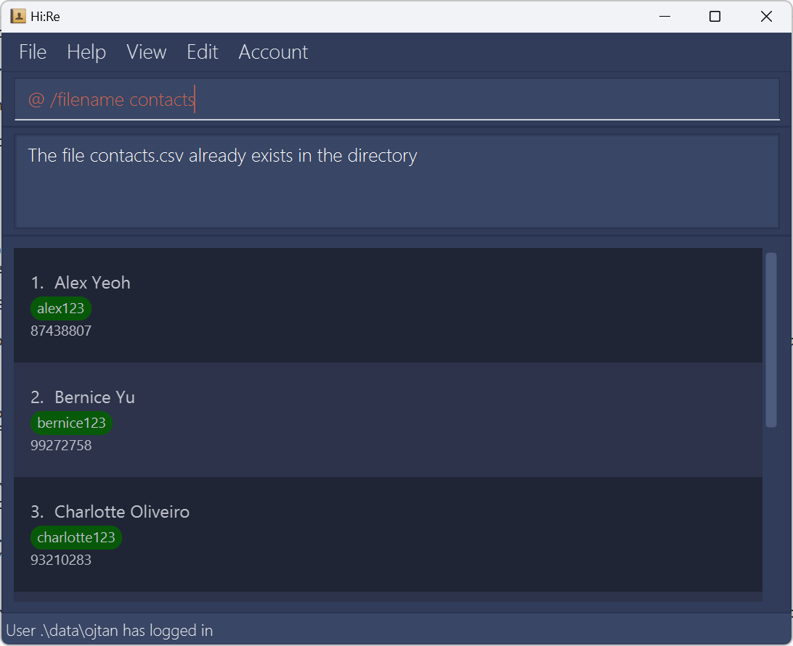  
      </box>
  
  

  <a href=#table-of-contents>
    back to top
    </a>
  

---

 \pagebreak 

### Link to our User Guide: `help`

Leads you to our user guide (i.e. this page) for guidance when using Hi:Re.

Format: `help`

 <box type="success">
    Pop-up box upon running the command.  
      
  </box>

  <a href=#table-of-contents>
    back to top
    </a>
  

---

### Exit the application: `exit`

Logs the user out of their account, and closes the Hi:Re application window.

Format: `exit`

  <a href=#table-of-contents>
    back to top
    </a>
  

---

 \pagebreak 

## Built-In Features

Features are built-in for your ease of use. No commands are required for it to work.

### Sort
  The addressbook is sorted in alphabetical order by name every time you add / edit / delete a new contact. 

  <a href=#table-of-contents>
    back to top
    </a>
  

---

### Delete sample data

Sample data is deleted when you add the first contact into the addressbook.  
  
<box type="important" seamless>
  It is important that you do **NOT** perform any operations other than adding contacts upon the sample data as there is no guarantee that this feature will work properly afterwards.
  </box>

  <box type="definition">
    Before:  
      
  </box>

  <box type="definition" theme="info">
    After:  
      
  </box>

  <a href=#table-of-contents>
    back to top
    </a>
  

---

### Information security

  Hi:Re seeks to protect the private information in your addressbook.  

  1. **Password Hashing** 
     We use the SHA-256 hashing algorithm to hash the passwords. 
     Passwords are hashed before being stored. Hence, even if the data file is compromised, the passwords are not easily retrievable. 

  <a href=#table-of-contents>
    back to top
    </a>
  

---

 \pagebreak 

## Design Methodology

Our software development team has meticulously crafted this application to provide
you with a seamless and intuitive user experience.
At the heart of our design methodology lies a commitment to simplicity, efficiency, and user-centricity.

**Dark Blue UI for Enhanced Comfort**

Our application features a sophisticated dark blue user interface, carefully chosen to promote relaxation and reduce eye
strain during extended usage sessions. We understand the importance of creating an environment that is both visually
appealing and gentle on the eyes. By embracing dark blue as our primary color scheme, we aim to enhance your overall
experience and encourage prolonged engagement with the application.

**Toggle Display Option for Streamlined Navigation**

Navigating through large amounts of contact data can be overwhelming. That's why we've implemented a convenient toggle display
option, allowing you to effortlessly hide or reveal extensive contact data sets with a simple click. This feature empowers you
to customize your viewing experience, providing flexibility and control over the information displayed on your screen.
Whether you're focusing on specific details or seeking a clutter-free interface, our toggle display option ensures seamless
navigation and enhanced productivity.

**Command-based Data Entry System**

We believe in minimizing unnecessary mouse usage and maximizing efficiency in data entry tasks. Our application boasts
a streamlined command-based data entry system, designed to simplify the input process and minimize user effort.
By leveraging intuitive keyboard commands, you can swiftly navigate through fields, input data, and execute commands
with precision and speed. This approach not only accelerates contact manipulation tasks but also reduces cognitive load, allowing
you to focus on your workflow without distractions.

**In summary**, our application's design methodology is guided by a dedication to user comfort, efficiency, and accessibility.
From the calming dark blue UI to the streamlined command-based data entry system, every aspect of our design reflects our
unwavering commitment to enhancing your productivity and satisfaction.

  <a href=#table-of-contents>
    back to top
    </a>
  

---

 \pagebreak 

## FAQ

<panel header="**Q**: How do I transfer my data to another Computer?">

**A**: Install Hi:Re in the other computer and overwrite the empty data file it creates with the file that contains the data of your previous Hi:Re home folder.
</panel>

<panel header="**Q**: What is Java 11 and where can I download it?">

**A**: Java 11 is the version of the Java Programming Language that our application uses to function. Any version of Java, 11 and above will work. You can download it from
the [official Java website](https://www.oracle.com/sg/java/).
</panel>

  <a href=#table-of-contents>
    back to top
    </a>
  

---

## Known issues

1. **When using multiple screens**, if you move the application to a secondary screen, and later switch to using only the primary screen, the GUI will open off-screen. The remedy is to delete the `preferences.json` file created by the application before running the application again.

2. Sample data sometimes does not clear if edited before a new contact is added. As such, we recommend that you add a new contact immediately upon first logging into Hi:Re before executing any other commands.

3. **When your contacts panel is hidden**, commands that show a list of contacts (like `ls` or `?`) will consequently not appear to do anything.
   Thus, if your result of one of these commands is unexpectedly empty, try toggling the panel and re-entering the command again.

4. Currently you cannot directly recover passwords of your accounts. If you forget the account password for a certain addressbook, please open `accounts.txt` and delete the whole line with the username of that addressbook. Then you can launch the application and register an account with the same username to access the original addressbook. But apart from this, please do not arbitrarily edit the txt file, as this may cause account information to be read incorrectly or even cause the application to fail to start.

  <a href=#table-of-contents>
    back to top
    </a>
  

  
 ---

 \pagebreak 

## Command summary

Action | Command Format
---|---
**Register** an account | `register /u (username) /p (password)`
**Login** into an account | `login /u (username) /p (password)`
**Logout** from an account | `logout`
**Add** a contact | `+ /name (name) /id (id) /hp (handphone) /tag (tag) {/tag (more tags)...}`
**Delete** a contact | `- /id (id)`
**Edit** a contact | `> (id) /name (name) /hp (handphone) /tag (tag) {/tag (more tags)...}`
**Clear** all contacts | `clear`
**Toggle** display | `$`
**Find** contacts by name | `? (keyword) {(more keywords)...}`
**List** all matching information | `ls (args)`
**Add** a **tag** | `tag+ (tag_name)`
**Delete** a **tag** | `tag- (tag_name)`
**Undo** previous command | `undo`
**Redo** a command | `redo`
**Export** data | `@`
Link to user guide | `help`
**Exit** the application | `exit`

  <a href=#table-of-contents>
    back to top
    </a>
  

---

 \pagebreak 

## Future Integrations

**In the future, we plan to integrate some of the following features:**

1. **A more rigorous account management system**, which will allow us to manage users as an admin, and assign different 
    levels of authentication or security.
2. **A remote database management system**, which links all Hi:Re instances on different machines to the same
    Hi:Re database, which will allow for collaboration and other benefits.
3. **More open-ended tagging and field options**, allowing for Hi:Re to be fully customisable as per the
    organisation's requirements.
4. **Multiple phone numbers**, allowing for contacts to add in both their office and personal phone numbers.

  <a href=#table-of-contents>
    back to top
    </a>
  

---

## Support and Feedback

We are a dedicated team of developers committed to evolving Hi:Re to always be better.

Should you have any enquiries or feedback, do reach out to us at our [website!](https://github.com/AY2324S2-CS2103T-T12-3)

  <a href=#table-of-contents>
    back to top
    </a>
  

