# Hi:Re User Guide

## Table of Contents

- [Welcome Note](#welcome-note)
- [Product Information](#product-information)
- [Quick Start](#quick-start)
- [Commands](#commands)
  1) [Registering an Account](#registering-an-account-coderegistercode)
  2) [Login into Account](#login-into-account-codelogincode)
  2) [Logout from Account](#logout-from-account-codelogoutcode)
  2) [Adding a Contact](#adding-a-contact-codecode)
  2) [Deleting a Contact](#deleting-a-contact-code-code)
  3) [Editing a Contact](#editing-a-contact-codecode)
  4) [Toggling the display](#toggling-the-display-codecode)
  5) [Finding Contacts by Name](#finding-contacts-by-name-codecode)
  5) [Listing all matching information](#listing-all-matching-information-codelscode)
  6) [Undoing a Command](#undoing-a-command-codeundocode)
  7) [Redoing a Command](#redoing-a-command-coderedocode)
- [Built-In Features](#built-in-features)
- [FAQ](#faq)
- [Known Issues](#known-issues)
- [Command Summary](#command-summary)
- [Future Integrations](#future-integrations)
- [Support and Feedback](#support-and-feedback)

## Welcome Note
Greetings HR employees, managers and executives! 

- Tired from **scrolling** through endless rows in **spreadsheet** applications?
- Worried about **data leak** issues caused by the lack in security of such applications?
- Frustrated by the **slow input** of cell by cell in such applications?
- Need an economically viable HR application?

*Well, Hi:Re, our one-stop employee profiling application is for you!*

We recommend reading our **[product information](#product-information)** section first to understand what Hi:Re
can do for you and if it suits your companies' needs! After that, 
dive into the **[quick start](#quick-start)** section, and we hope you 
enjoy using Hi:Re as your company's HR employee profiling solution!

***

## Product Information

[back to top](#table-of-contents)

Hi:Re is a **desktop app for managing employee details,
optimized for use via a Command Line Interface** (CLI)
while still having the benefits of a Graphical User Interface (GUI).

That means most work is done via *typing* commands on a command line instead of *clicking* with your mouse!
- **Fast types**, Hi:Re will be your **best assistant** to get your contact management tasks done
  **faster** than traditional GUI apps.
- Regardless of your *technical skill* level, our User Guide will **bring you up to speed** and **quickly master**
  Hi:Re, that is already **streamlined for HR purposes**!

<box type="info" seamless> 

**IMPORTANT: In Hi:Re, we adopt a system where contacts are identified by their email id(company email) without the
company email domain.**   

*John is identified by his email id, john123 without the domain, @123company.com*

Hence, we allow duplicate names and handphone numbers.
Contacts are also labelled with one mandatory tag and optional additional tags.
</box>

Breakdown of commands:
1) Register, Login and Logout: Data Management
2) Adding a Contact 
3) Deleting a Contact 
4) Edit a Contact 
5) Toggling the Display 
6) Find Contacts by name 
7) Listing all matching information 
8) Undoing a Command
9) Redoing a Command 
10) Export data into .csv file

***

## Quick start
[back to top](#table-of-contents)

1. Ensure you have Java `11` or above installed in your Computer.

1. Download the latest `HiRe.jar` from [here](https://github.com/AY2324S2-CS2103T-T12-3/tp/releases).

1. Copy the file to the folder you want to use as the _home folder_.

1. Open a command terminal, `cd` into the folder you put the `HiRe.jar` file in, and use the `java -jar HiRe.jar` command to run the application. 

   A GUI similar to the below should appear in a few seconds. 
   
   <box type="info" seamless>Note how the app contains some sample data.</box>

   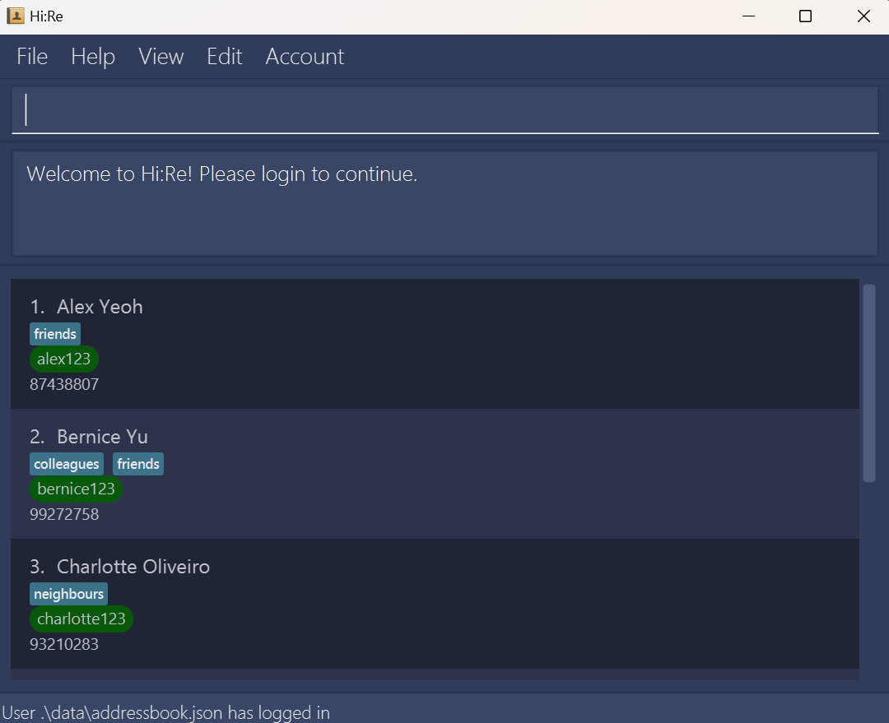 

1. Type commands in the `command box` and press `Enter` to execute it, but first...

1. [Register](#registering-an-account-coderegistercode) an account before you are ready to use Hi:Re!

1. [Log into](#login-into-account-codelogincode) your newly registered account with the correct username and password!

1. Refer to the [Commands](#commands) below for details of each command.

1. Refer to the [Built-In Features](#features) below for details of built-in features.

***

## Commands
[back to top](#table-of-contents)

<box type="info" seamless>

**Notes about the command format:** 

* Words in `()` are the parameters to be supplied by the user. 
  e.g. in `- /id (id)`, `(id)` is a parameter which can be used as `- /id johndoe69`.

* If you are using a PDF version of this document, be careful when copying and pasting commands that span multiple lines as space characters surrounding line-breaks may be omitted when copied over to the application.
</box>

<!--
### Viewing help : `help`

Shows a message explaning how to access the help page.

Format: `help`
-->

### Registering an Account: <code>register</code>
[back to top](#table-of-contents)

Register an account first to have your own address book!  
Format: `register /u (username) /p (password)`  
Example: `register /u johndoe /p 123456` 

  <box type="important" seamless>

* This command can also be used by clicking in the `Account` section of the menu bar.    
* A valid password is between 6 and 20 characters long and does not contain spaces.   
* A valid username should be alphanumeric and between 4 and 10 characters long.   
* Usernames are unique and cannot be duplicated.   
  </box>

**Confirmation of Successful Registration** 

If the user registers successfully, a graphical user interface (GUI) indicative of a successful registration will be displayed, as illustrated below. 

  <box type="success">
    GUI upon successful register command   
    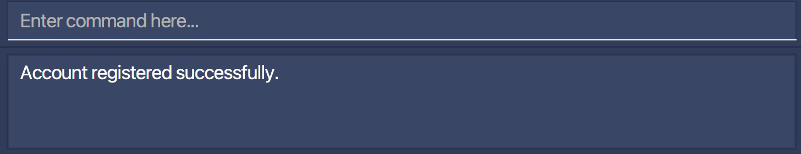 
  </box> 

* **Error Handling Protocols** 

    1. Duplicate username Error: Entry of a non-unique username will trigger an error. 
       <box type="wrong">
       Duplicate username error   
       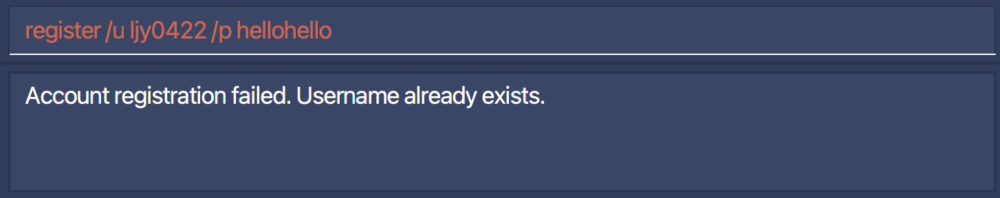  
       </box>
    2. Incomplete Fields Error: Failure to complete all required fields will trigger an error. 
       <box type="wrong">
       Incomplete fields error   
       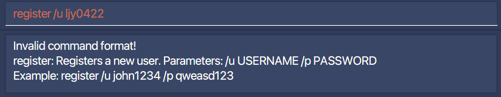  
       </box>
    3. Invalid Fields Error: Any input field violating the requirements mentioned above will trigger an error.
       <box type="wrong">
       Invalid fields error   

        * Invalid username

       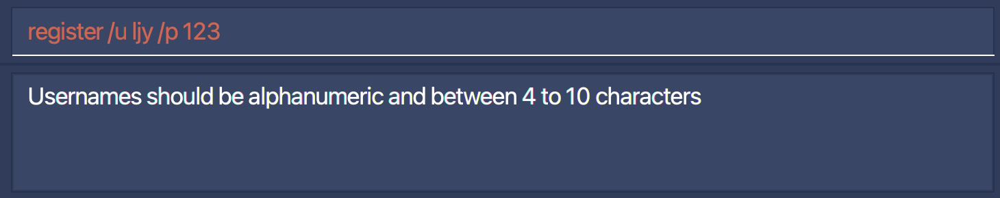  

        * Invalid password

       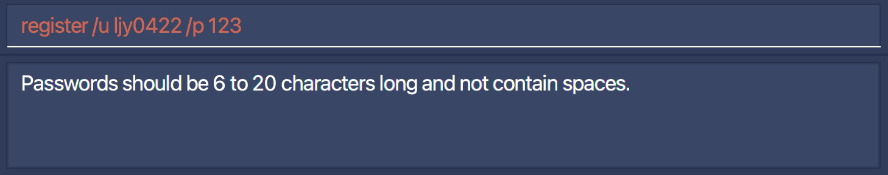  
       </box>

### Login into Account: <code>login</code>
[back to top](#table-of-contents)

Login to access your addressbook.   
Format: `login /u (username) /p (password)`  
Example: `login /u johndoe /p 123456` 

  <box type="important" seamless>

* This command can also be used by clicking in the `Account` section of the menu bar.    
* A valid password is between 6 and 20 characters long and does not contain spaces.   
* A valid username should be alphanumeric and between 4 and 10 characters long.   
  </box>

**Confirmation of Successful Login** 

If the user Logins successfully, a graphical user interface (GUI) indicative of a successful login will be displayed, as illustrated below. 

  <box type="success">
    GUI upon successful login command   
    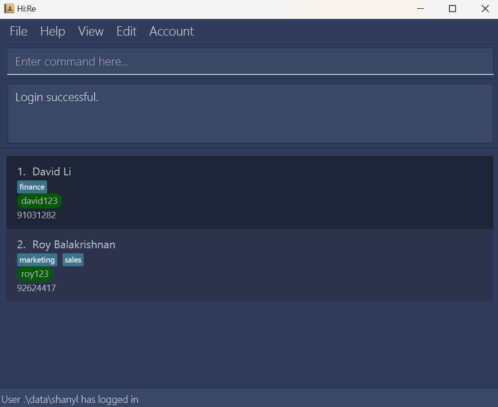 
  </box> 

* **Error Handling Protocols** 

    1. Incomplete Fields Error: Failure to complete all required fields will trigger an error. 
       <box type="wrong">
       Incomplete fields error   
       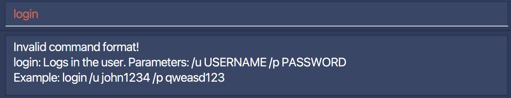  
       </box>
    2. Invalid Fields Error: Any input field violating the requirements mentioned above will trigger an error. 
       <box type="wrong">
       Invalid fields error   

        * Invalid username

       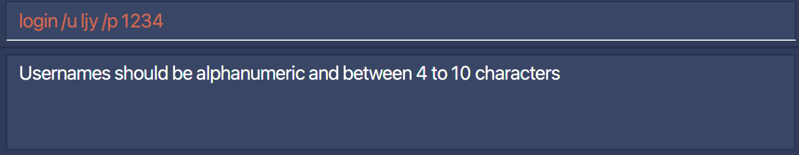  

        * Invalid password

       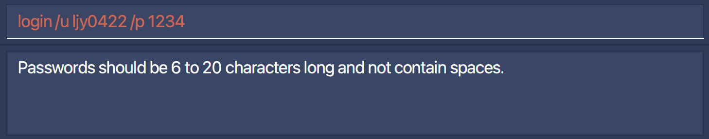  
       </box>
    3. Incorrect Username or Password Error: If the username or password is incorrect, an error will be triggered. 
       <box type="wrong">
       Incorrect username or password error   
         
       </box>
    4. Already Logged In Error: If the user is already logged in, he cannot log in again. 
       <box type="wrong">
       Already logged in error:  
         
       </box>

### Logout from Account: <code>logout</code>
[back to top](#table-of-contents)

After you end accessing your addressbook, log out to protect the data.   
Format: `logout`  

**Confirmation of Successful Logout** 

If the user Logouts successfully, a graphical user interface (GUI) indicative of a successful logout will be displayed, as illustrated below. 

  <box type="success">
    GUI upon successful logout command   
    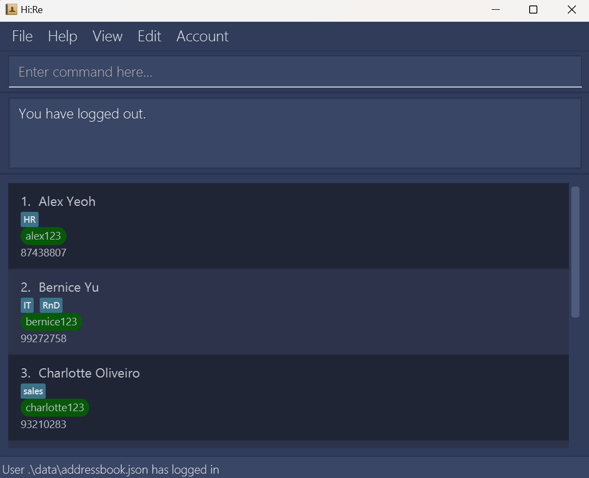 
  </box> 

* **Error Handling Protocols** 

    1. Not Logged Error: If the user hasn't logged in, he cannot log out. 
       <box type="wrong">
       Not Logged Error:  
         
       </box>

       
### Adding a contact: <code>+</code>
[back to top](#table-of-contents)

  Adds a person to the address book.  

  Format: <code>+ /name (name) /id (id) /hp (handphone)</code> 

  Example: <code>+ /name John Doe /id johndoe41 /hp 98765432</code> 

  <box type="important" seamless>

  * The order of input values is interchangeable and doesn't matter. Feel free to input the details in any sequence as long as all required information is provided.

  * The ID must be unique for each contact. ID cannot duplicate with existing IDs. Attempting to use a duplicate ID will result in an error.

  * The ID can include alphabets, numbers, and special characters, but cannot be blank and should not contain whitespaces.

  * The phone number should only contain numbers, and it should be at least 3 digits long.
  * Only one phone number is allowed. Refer to future integrations for more info. 

  * The name should only contain alphanumeric characters and spaces, and should not be blank.
  
  </box>

  (The Initial UI before addition)                       
     

  * **Confirmation of Successful Contact Addition** 

  Following the accurate input of the command, a graphical user interface (GUI) indicative of a successful contact addition will be displayed, as illustrated below.
  <box type="success">
    GUI upon successful addition command   
    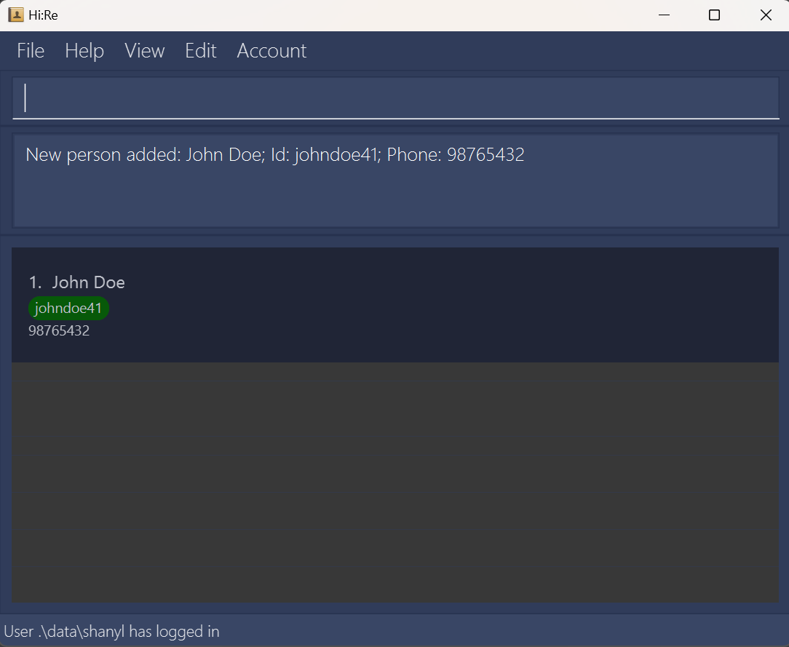  
  </box>

  * **Error Handling Protocols**  

    1. Duplicate ID Error: Entry of a non-unique ID will trigger an error. 
       <box type="wrong">
       Duplicate ID error   
       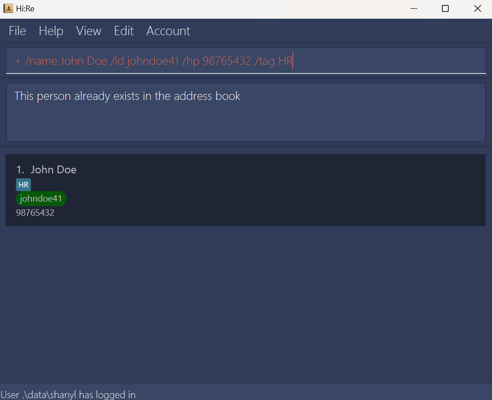  
       </box>

    2. Incomplete Fields Error: Failure to complete all required fields will trigger an error. 
       <box type="wrong">
       Incomplete fields error   
         
       </box>
     
    3. Invalid Fields Error: Any input field violating the requirements mentioned above will trigger an error.
       <box type="wrong">
       Invalid fields error   
    
       * Invalid name
       
         
    
       * Invalid phone number
       
       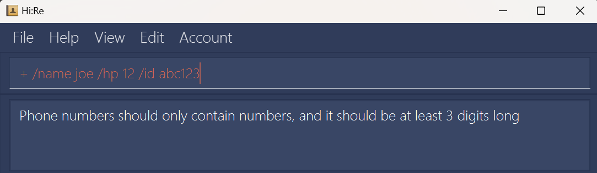  
       
       * Invalid id
       
         
       </box>

### Deleting a contact: <code>-</code>
[back to top](#table-of-contents)

  Deletes a person with his specified ID.  

  Format: <code>- /id (id)</code> 

  Example: <code>- /id johndoe46</code> 

  <box type="important" seamless>

* The ID can include alphabets, numbers, and special characters, but cannot be blank and should not contain whitespaces.

  </box>
  (The Initial UI before deletion)
  
   

  * **Confirmation of Contact Deletion** 
  
  Following the accurate input of the command, if the person with the input id does exist in the address book, a window will pop up asking for your confirmation to delete.
  Click OK to continue with the deletion. After confirmation, a graphical user interface (GUI) indicative of a successful contact deletion will be displayed, as illustrated below.
  <box type="success">
  
  * Pop-up window for confirmation
  
    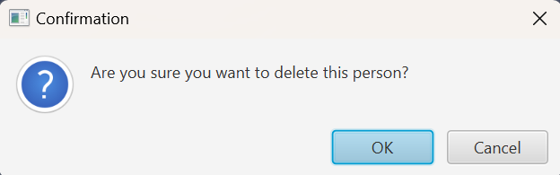  

  * GUI upon successful addition command   
  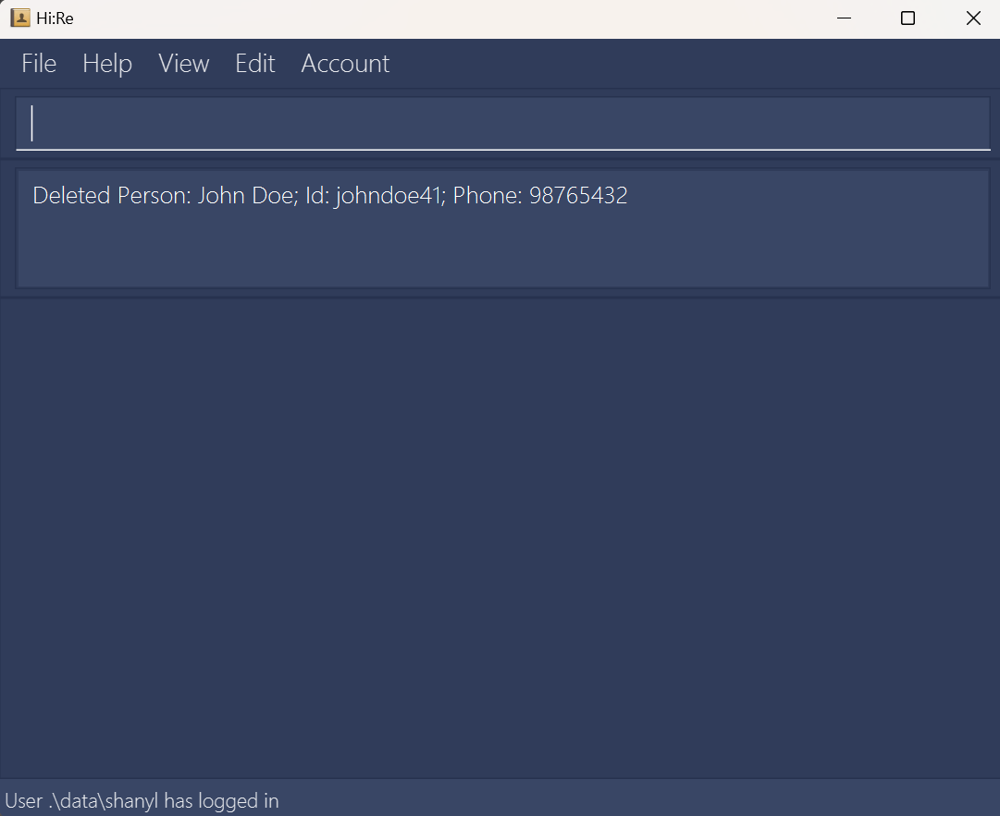  
  </box>

  * **Error Handling Protocols** 
  
    1. ID Not Found Error: If there is no such person with the input id in the list, an error will be triggered.
       <box type="wrong">
       ID not found error   
       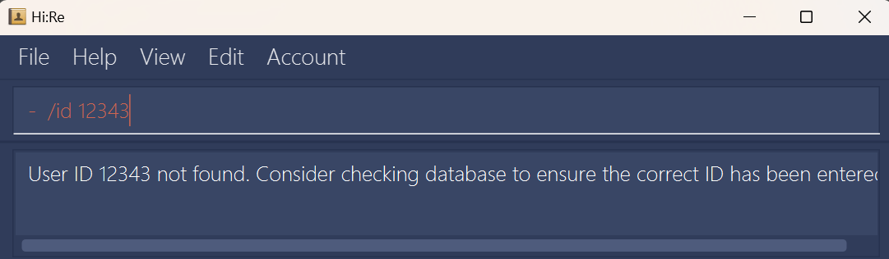  
       </box>
    
    2. Command Cancelled Error: When the confirmation dialog box pops up, if the user chooses to cancel the operation, it can trigger an error.
       <box type="wrong">
       Command cancelled error   
       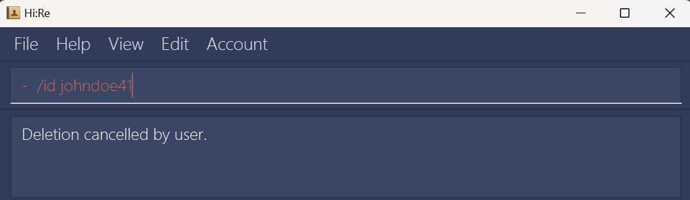  
       </box>
    
    3. Incomplete Field Error: Failure to input the required id with the correct prefix will trigger an error.
       <box type="wrong">
       Incomplete field error   
       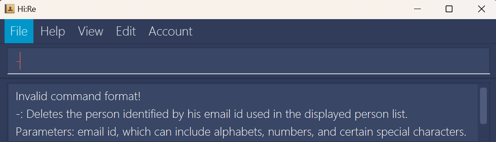  
       </box>

    4. Invalid Field Error: If the input id violates the requirements, it is invalid and should trigger an error.
        <box type="wrong">
        Invalid field error   
          
        </box>

### Editing a contact: <code>+</code>
[back to top](#table-of-contents)

Edits a person in the address book.  

Format: <code> > (id) /name (name) /hp (handphone)</code> 

Example: <code> > johndoe41 /name John Joe /hp 98765432</code> 

  <box type="important" seamless>

* The ID must be the first thing typed in. Other than that, the order of the other fields are interchangeable and doesn't matter. Feel free to input the details in any sequence. 

* Fields to be edited are optional, but at least 1 field must be given. ID does not count. ID is used to identify the contact.

* The phone number should only contain numbers, and it should be at least 3 digits long.

* The name should only contain alphanumeric characters and spaces, and should not be blank.

* If the fields match the current contact's fields exactly, the edit will still go through and not give a duplicate person error message. This is due to our unique identifier id.

* Should you wish to edit the id of the person, please delete the contact and re-add the contact with the correct id. 

  </box>

(The Initial UI before editing)                       
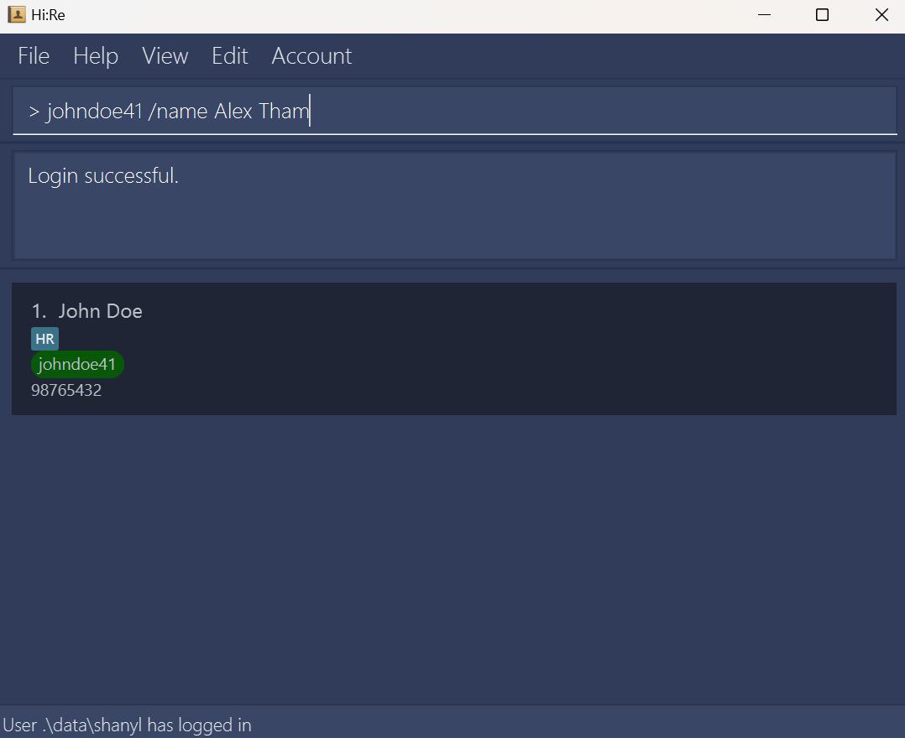 

* **Confirmation of Successful Contact Editing** 

Following the accurate input of the command, a graphical user interface (GUI) indicative of a successful contact addition will be displayed, as illustrated below.
<box type="success">
GUI upon successful addition command   
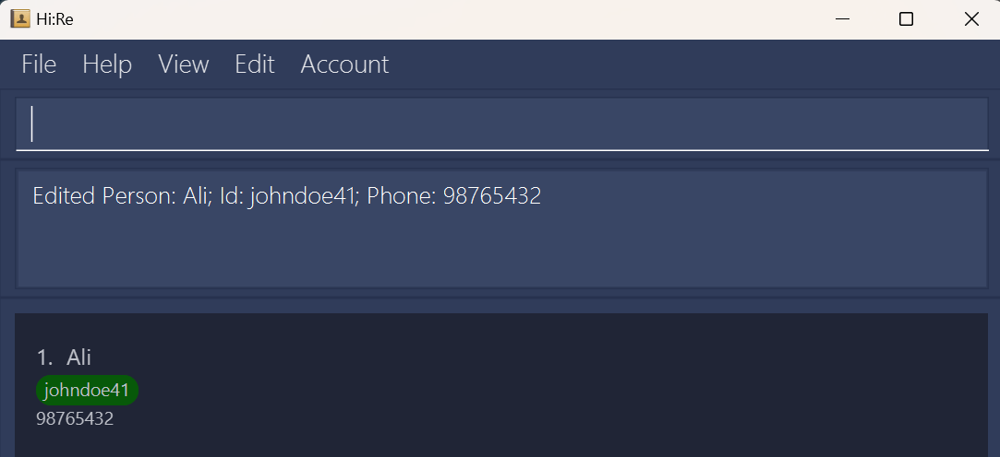  
</box>

* **Error Handling Protocols** 
    1. No ID Error: No ID given will trigger an error.
       <box type="wrong">
       No ID error   
       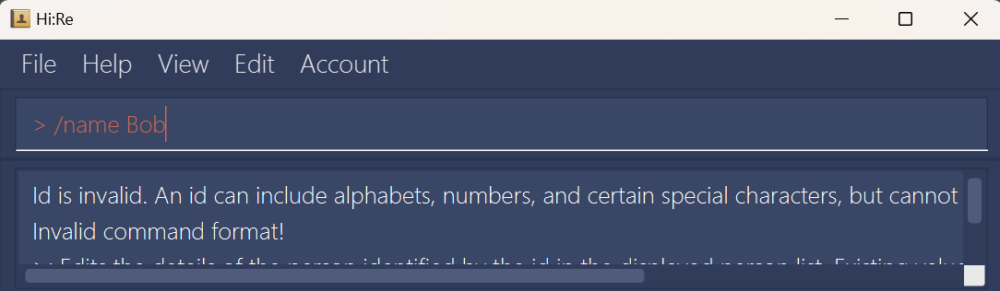  
       </box>

    2. Incomplete Fields Error: Failure to complete at least 1 field will trigger an error.
       <box type="wrong">
       Incomplete fields error   
       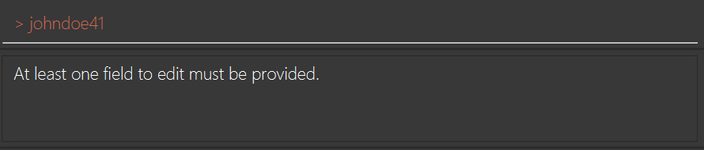  
       </box>

    3. Invalid Fields Error: Any input field violating the requirements mentioned above will trigger an error.
       <box type="wrong">
       Invalid fields error   

        * Invalid name

       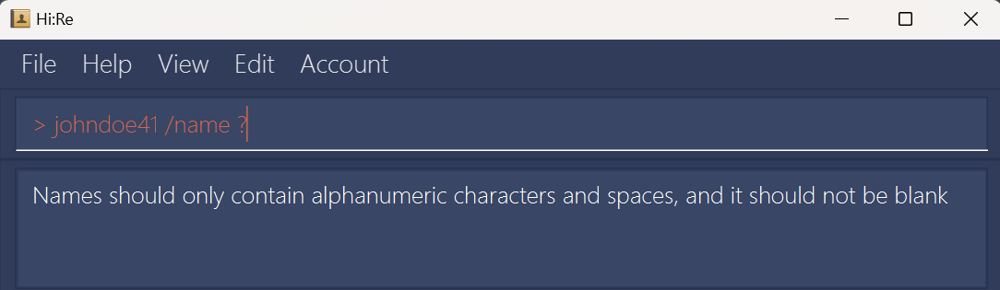  

        * Invalid phone number

       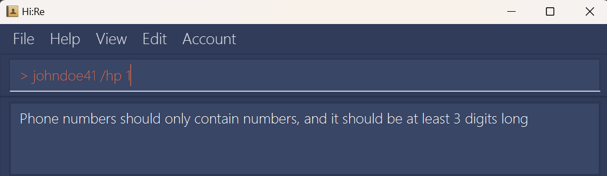  

        * Id not found

       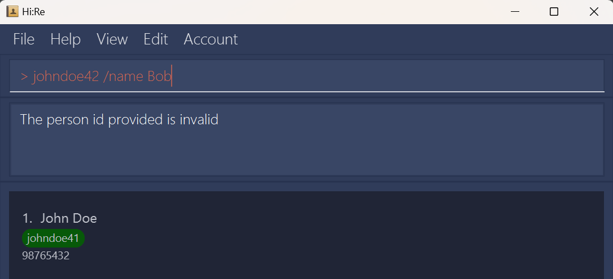  
       </box>

### Toggling the display: <code>$</code>
[back to top](#table-of-contents)

Toggles the display to view / hide the contacts panel of Hi:Re.  

  Format: <code>$</code> 

  <box type="definition">
    Viewing contacts.  
    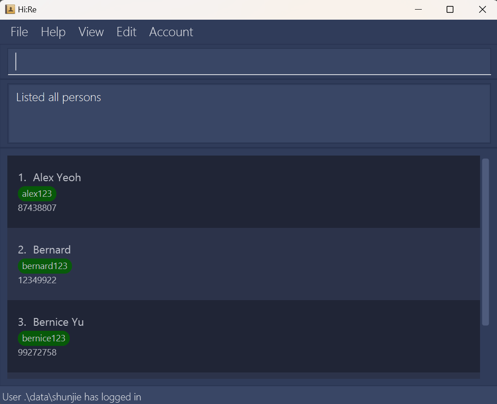  
  </box>

  <box type="definition" theme="info">
    Hiding contacts.  
    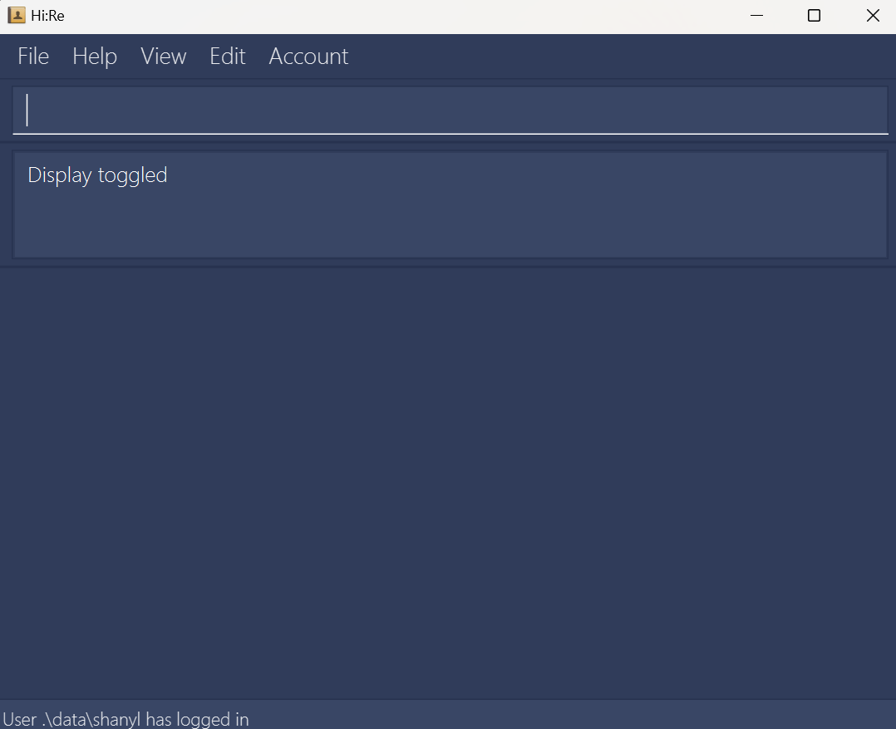  
  </box>

### Finding Contacts by Name: <code>?</code>
[back to top](#table-of-contents)

Finds all contacts in the Hi:Re app that has names matching the words entered.

Format: <code> > ? (name) </code> 

Example: <code> > ? jo </code>
         <code> > ? jo a </code> 

<box type="important" seamless>

* All names consist of alphanumeric characters, hence any non-alphanumeric characters used will result in no contacts found.
* All names that contain the words entered will be matched. E.g `? jo` will give John if John exists in the contacts 
list.
* More than one word can be entered, separated by spaces. All names that match **any** of the words will be matched.
E.g `? jo a` will give John and Ali if both of them exists in the contacts list.

  </box>

### Listing all matching information: <code>ls</code>
[back to top](#table-of-contents)

  List has different functionalities.  

  Format: <code>ls ARGS</code> 
  
  <code>ARGS</code> = <code>-a</code>: List all contacts in the address book.  
  <code>ARGS</code> = <code>-t</code>: List all tags available.  
  <code>ARGS</code> = <code>TAG_NAME</code>: List all contacts with <code>TAG_NAME</code>.  

### Add Tag: <code>tag+</code>
[back to top](#table-of-contents)

  Add tag into a tag list.  

  Format: <code>tag+ TAG_NAME</code> 

  <box type="important">

* **MUST** add a tag into a tag list before adding a person.
  
  </box>

### Delete Tag: <code>tag-</code>
[back to top](#table-of-contents)

  Delete tag from the tag list.  

  Format: <code>tag- TAG_NAME</code> 

  <box type="important">
  
  Tag cannot be removed if a person is tagged with the tag-to-be-removed.
  
  </box>

### Undoing a Command: <code>undo</code>
[back to top](#table-of-contents)

Restores the address book to the state before the previous **undoable** command was executed. 
Format: `undo` 
<box type="important" seamless>

* This command can also be used by clicking in the `edit` section of the menu bar.    
* Undoable commands: those commands that modify the address book’s content (add, delete, edit and clear).
  </box>

Example: 
1. Delete the person with the id `johndoe41`. 
2. Undo the deletion. The person will reappear.  

* **Confirmation of Successful Undo** 

  If there is still any executed command that can be undone, a graphical user interface (GUI) indicative of a successful undo will be displayed, as illustrated below. 

  <box type="success">
    GUI upon successful undo command   
    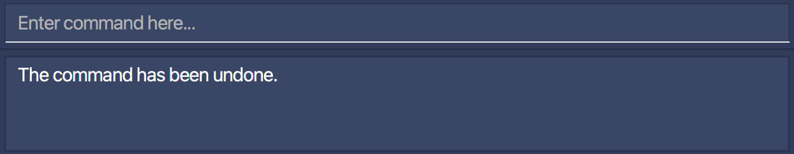 
  </box> 

* **Error Handling Protocols** 

    1. No Undoable Command Error: If there is no more executed command that can be undone, an error will be triggered. 
       <box type="wrong">
       No undoable command error   
       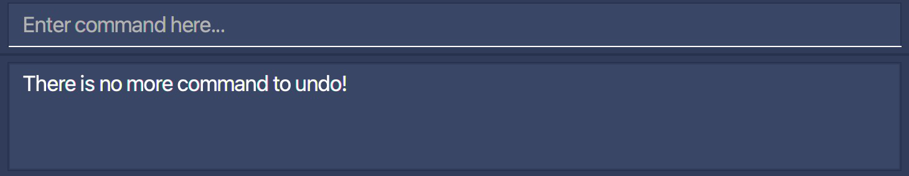  
       </box>

### Redoing a Command: <code>redo</code>
[back to top](#table-of-contents)

Reverses the most recently undone command. 
Format: `redo` 

  <box type="important" seamless>

* This command can also be used by clicking in the `edit` section of the menu bar. Typing the command `redo` in the command box will not work.  

  </box>
Example: 
1. Delete the person with the id `johndoe41`. 
2. Undo the deletion. The person will reappear. 
3. Redo the undone deletion. The person will be deleted again.  

* **Confirmation of Successful Redo** 

  If there is still any undone command that can be redone, a graphical user interface (GUI) indicative of a successful redo will be displayed, as illustrated below. 

  <box type="success">
    GUI upon successful redo command   
    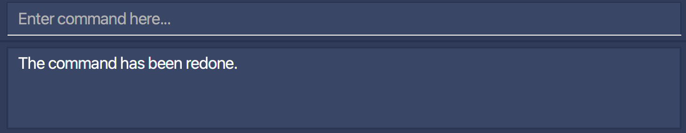 
  </box> 

* **Error Handling Protocols** 

    1. No Redoable Command Error: If there is no more undone command that can be redone, an error will be triggered. 
       <box type="wrong">
       No redoable command error   
       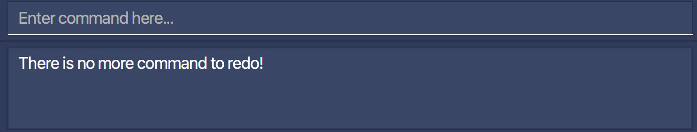  
       </box>

<!--

### Listing all persons : `list`

Shows a list of all persons in the address book.

Format: `list`

### Editing a person : `edit`

Edits an existing person in the address book.

Format: `edit INDEX [n/NAME] [p/PHONE] [e/EMAIL] [a/ADDRESS] [t/TAG]…​`

* Edits the person at the specified `INDEX`. The index refers to the index number shown in the displayed person list. The index **must be a positive integer** 1, 2, 3, …​
* At least one of the optional fields must be provided.
* Existing values will be updated to the input values.
* When editing tags, the existing tags of the person will be removed i.e adding of tags is not cumulative.
* You can remove all the person’s tags by typing `t/` without
    specifying any tags after it.

Examples:
*  `edit 1 p/91234567 e/johndoe@example.com` Edits the phone number and email address of the 1st person to be `91234567` and `johndoe@example.com` respectively.
*  `edit 2 n/Betsy Crower t/` Edits the name of the 2nd person to be `Betsy Crower` and clears all existing tags.

### Locating persons by name: `find`

Finds persons whose names contain any of the given keywords.

Format: `find KEYWORD [MORE_KEYWORDS]`

* The search is case-insensitive. e.g `hans` will match `Hans`
* The order of the keywords does not matter. e.g. `Hans Bo` will match `Bo Hans`
* Only the name is searched.
* Only full words will be matched e.g. `Han` will not match `Hans`
* Persons matching at least one keyword will be returned (i.e. `OR` search).
  e.g. `Hans Bo` will return `Hans Gruber`, `Bo Yang`

Examples:
* `find John` returns `john` and `John Doe`
* `find alex david` returns `Alex Yeoh`, `David Li` 
  

### Deleting a person : `delete`

Deletes the specified person from the address book.

Format: `delete INDEX`

* Deletes the person at the specified `INDEX`.
* The index refers to the index number shown in the displayed person list.
* The index **must be a positive integer** 1, 2, 3, …​

Examples:
* `list` followed by `delete 2` deletes the 2nd person in the address book.
* `find Betsy` followed by `delete 1` deletes the 1st person in the results of the `find` command.

### Clearing all entries : `clear`

Clears all entries from the address book.

Format: `clear`

### Exiting the program : `exit`

Exits the program.

Format: `exit`

### Saving the data

AddressBook data are saved in the hard disk automatically after any command that changes the data. There is no need to save manually.

### Editing the data file

AddressBook data are saved automatically as a JSON file `[JAR file location]/data/addressbook.json`. Advanced users are welcome to update data directly by editing that data file.

<box type="warning" seamless>

**Caution:**
If your changes to the data file makes its format invalid, AddressBook will discard all data and start with an empty data file at the next run.  Hence, it is recommended to take a backup of the file before editing it. 
Furthermore, certain edits can cause the AddressBook to behave in unexpected ways (e.g., if a value entered is outside the acceptable range). Therefore, edit the data file only if you are confident that you can update it correctly.
</box>

### Archiving data files `[coming in v2.0]`

_Details coming soon ..._

--------------------------------------------------------------------------------------------------------------------
-->
***

## Built-In Features

[back to top](#table-of-contents)

Features are built-in for the ease of use. They do not require any commands for it to work.

### Sort
  The addressbook is sorted in alphabetical order every time a new contact is added / deleted.  

  <box type="definition">
    Before.  
    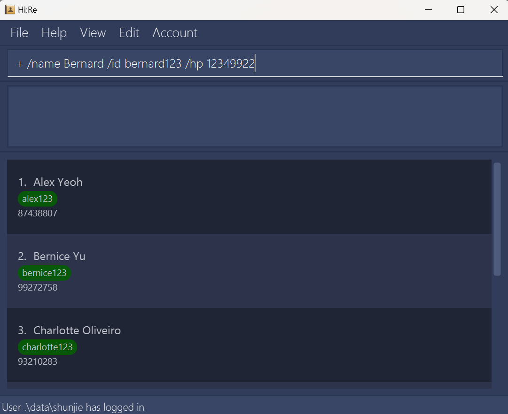  
  </box>

  <box type="definition" theme="info">
    After.  
    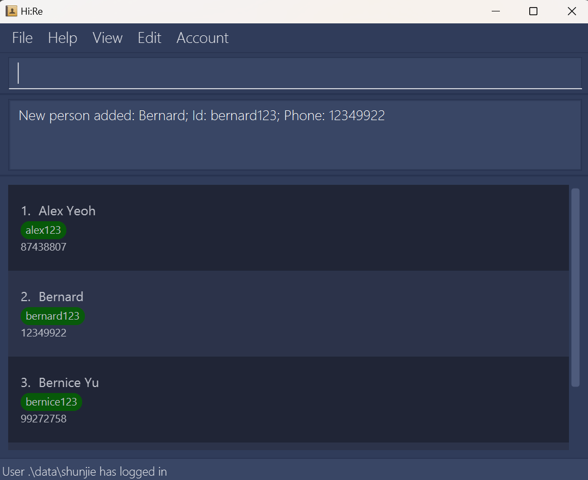  
  </box>

### Delete sample data
  Sample data is deleted when you add the first contact into the addressbook.  

  <box type="definition">
    Before.  
    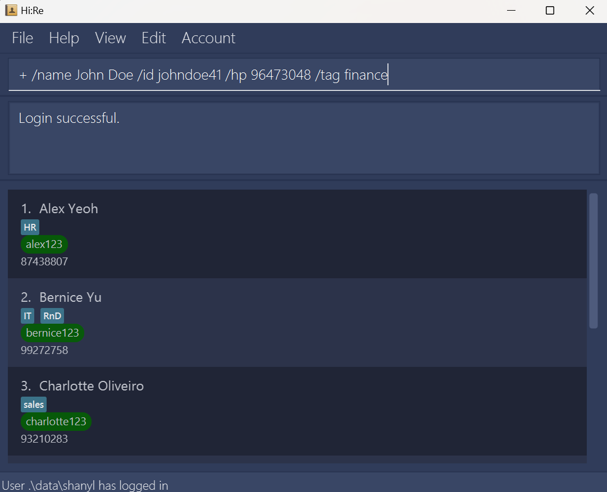  
  </box>

  <box type="definition" theme="info">
    After.  
    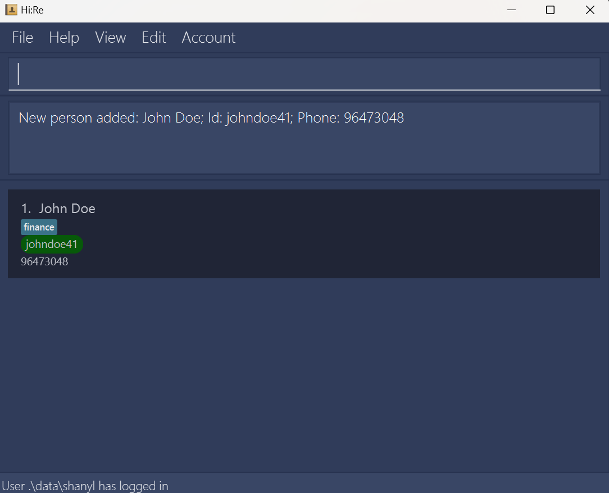  
  </box>

### Information security
  We try our best to protect the private information in your addressbook.  

  1. **Password Hashing** 
     We use the SHA-256 hashing algorithm to hash the passwords. 
     Passwords are hashed before being stored in the database.  This means that even if the database is compromised, the passwords are not easily retrievable. 
  
  2. **Data Encryption** 
     We use the Advanced Encryption Standard (AES) to encrypt the data in the addressbook.  
     Data in the addressbook is encrypted before being stored in the database. This means that even if the user accesses the database directly, the data is unreadable. 
     <box type="important" seamless>
           Due to the technical limitations of the application, the encryption key is stored in the application itself for now.  
           This means that if the source code of application is compromised, the data can be decrypted.  
           However, we are working on a more secure solution for future versions of the application.
     </box>

***

## FAQ

[back to top](#table-of-contents)

<panel header="**Q**: How do I transfer my data to another Computer?">

**A**: Install the app in the other computer and overwrite the empty data file it creates with the file that contains the data of your previous Hi:Re home folder.
</panel>
<panel header="**Q**: What is Java 11 and where can I download it?">

**A**: Java 11 is the version of the Java Programming Language that our application uses to function. Any version of Java, 11 and above will work. You can download it from
the [official Java website](https://www.oracle.com/sg/java/).
</panel>

***

## Known issues

[back to top](#table-of-contents)
1. **When using multiple screens**, if you move the application to a secondary screen, and later switch to using only the primary screen, the GUI will open off-screen. The remedy is to delete the `preferences.json` file created by the application before running the application again.

***

## Command summary

[back to top](#table-of-contents)

Action     | Format
-----------|---------
**Add**    | `+ /name (name) /id (id) /hp (handphone)`
**Delete** | `- /id (id)`
**Edit** | `> (id) /name (name) /hp (handphone)`
**Toggle** | `$`

***

## Future Integrations

[back to top](#table-of-contents)

**In the future, we plan to integrate some of the following features:**

1. **A more rigorous account management system**, which will allow us to manage users as an admin, and assign different 
    levels of authentication or security.
2. **A remote database management system**, which links all Hi:Re instances on different machines to the same
    Hi:Re database, which will allow for collaboration and other benefits.
3. **More open-ended tagging and field options**, allowing for Hi:Re to be fully customisable as per the
    organisation's requirements.
4. **Multiple phone numbers**, allowing for contacts to add in both their office and personal phone numbers.

***

## Support and Feedback

[back to top](#table-of-contents)

We are a dedicated team of developers committed to evolving Hi:Re to always be better.

Should you have any enquiries or feedback, do reach out to us at our [website!](https://github.com/AY2324S2-CS2103T-T12-3)
